# Homework4 report

### What scenario do I apply in?
I apply the bi-cycle GAN to the famous images, which transfer the image style among Ukiyoe, Monet, Vangogh and photos. The main motivation is to see what the famous paintings would look like if other artists paint the same scenery.

In my experiment, the two cycles are `Ukiyoe -> photo -> Ukiyoe'` and `Vangogh -> photo -> Vangogh'`. The common domain is photo. I aim to show the paintings of Vangogh in Ukiyoe style.

### What do I modify? 
For now, I only train the [CycleGAN](https://arxiv.org/abs/1703.10593) with different datasets and haven't modified the codes of [BiCycleGAN](https://arxiv.org/pdf/1711.11586.pdf).

### Qualitative results
First I'll show the results for single cycle GAN. The first image is the original one, the second is transferred image and the last is the reconstructed image. 

## Ukiyoe to Photo 
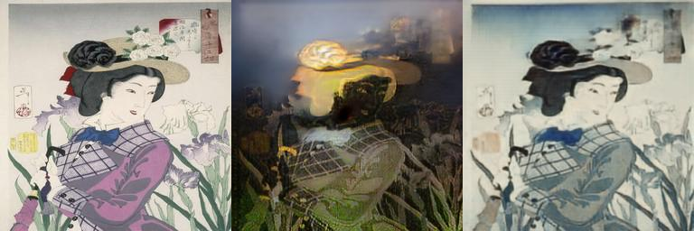
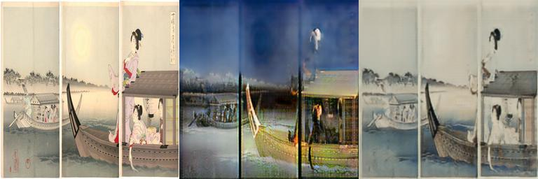

## Photo to Ukiyoe
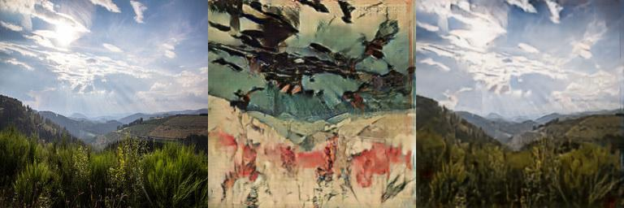
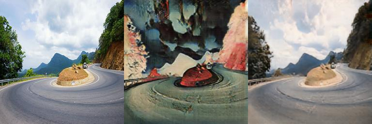

## Vangogh to Photo
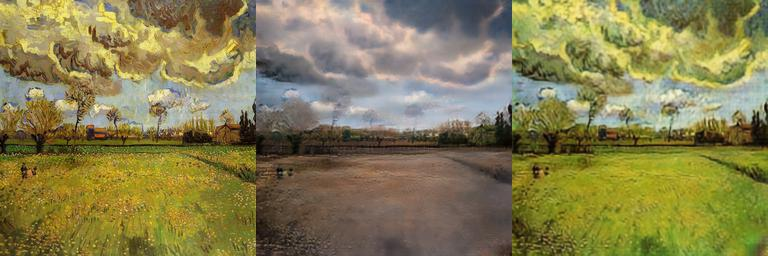
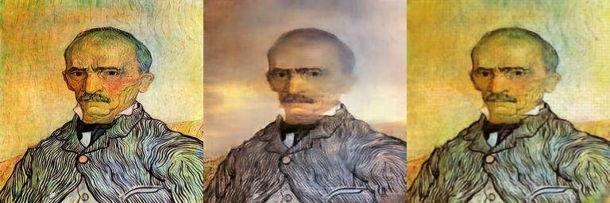

## Photo to Vangogh
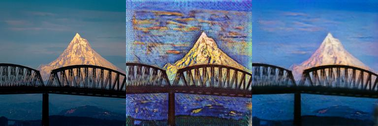
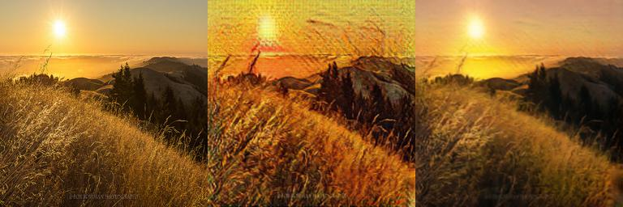
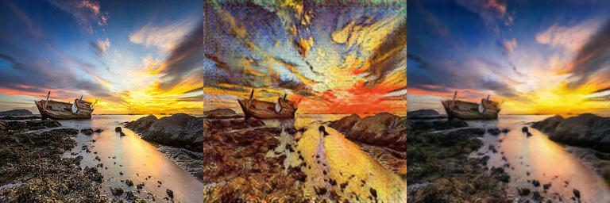

## Vangogh to Photo to Ukiyoe
Following is the images from `Vangogh`, transferred to common domain `photo` and then transferred to `Ukiyoe` style.
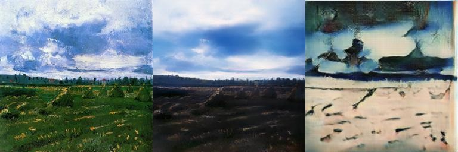
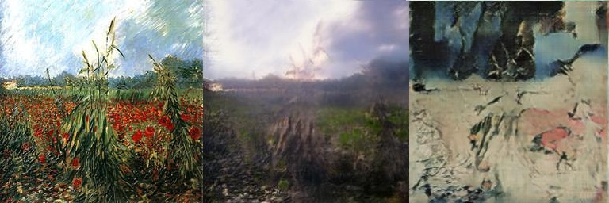

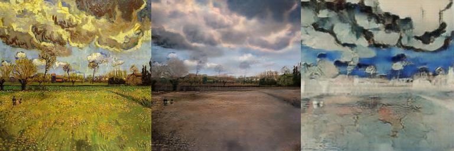
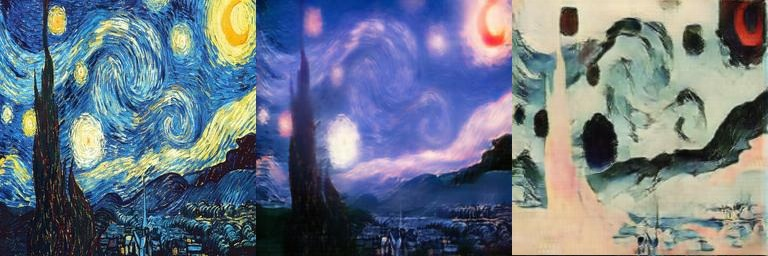

### My thoughts 
1. The reason why I didn't transfer the `Ukiyoe` to `photo` to `Vangogh` is that reconstructed photos from Ukiyoe are kind of weird. This is because most images in the `photo` dataset are scenery photos and almost no portraiture, in the `Ukiyoe` dataset however, most images are portraitures. Thus, it's hard for the model to generate the photo style images from `Ukiyoe` images. 

2. It's relatively easy to transfer photos to `Ukiyoe` or `Vangogh` style images, but the reverse is hard. I think it's because compared to paintings, photos have more information, more details. From the images given above, results of adding style to photos seem to be rather natural. 

### Reference
[CycleGAN](https://github.com/LynnHo/CycleGAN-Tensorflow-PyTorch-Simple) implementation from github
