# 張偲宇 (106062555)

# Homework4 report

## Bi-CycleGAN for Unpaired Image-to-Image-to-Image Translation

>Cycle 1: A ←→ B
>
>Cycle 2: A ←→ C

A is the common domain (or common modality) shared by the two cycles.


### What scenario do I apply in?
you are encouraged to elaborate the motivation here

* Style Transfer [2]
	- Transferring between real photos and artistic styles of Monet and Ukiyo-e (Monet ←→ Photo ←→ Ukiyo-e)
	
	>A: Photo   (landscape photographs)
	>
	>B: Monet   (landscape painting)
	>
	>C: Ukiyo-e (portrait painting)


### What do I modify?
you can show some snippet

#### Separate training
- Simply train two CycleGANs separately using the original code [3] of CycleGAN [1]
	+ Original GAN loss for generator and discriminator
	<p align="center">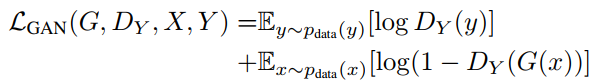</p>
	+ Cycle-consistent loss for forward and backward cycles
	<p align="center">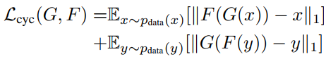</p>
	+ Identity mapping loss for real samples
	<p align="center"></p>

#### Joint training
- Jointly train the two cycles with additional constraints on the consistency of the shared domain
	+ bi_backward_consistency_loss
		* using Maximum Mean Discrepancy (MMD) to measure distribution between two domains ((A,B) and (A,C) pairs)
<p align="center">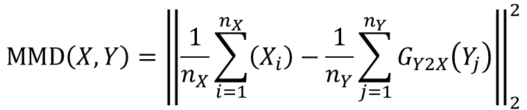</p>
```
def bi_backward_consistency_loss(self, XY_F, XZ_F, x, y, z):
	""" bi-backward MMD consistency loss (L2 norm)
	"""
	mean_Y2X = tf.reduce_mean(XY_F(y), axis=0)
	mean_Z2X = tf.reduce_mean(XZ_F(z), axis=0)
	mean_X = tf.reduce_mean(x, axis=0)
	XY_backward_loss = tf.reduce_mean(tf.square(mean_Y2X - mean_X))
	XZ_backward_loss = tf.reduce_mean(tf.square(mean_Z2X - mean_X))
	loss = XY_backward_loss + XZ_backward_loss
	return loss
```

#### Code execution (see [3] for more details)
- Data preparing
```
bash download_dataset.sh monet2photo
bash download_dataset.sh ukiyoe2photo

bash gen_build_data.sh monet photo
bash gen_build_data.sh ukiyoe photo
```

- Training
```
bash run_train.sh photo monet ukiyoe
```

- Export model
```
bash run_export_graph.sh monet2photo photo monet ukiyoe 2017xxxx-xxxx
```

- Inference
```
bash run_inference.sh photo monet
bash run_inference.sh photo ukiyoe
```


### Qualitative results
put some interesting images generated from your Bi-CycleGANs

<table border=1>
<tr>
<td colspan="3">
Photo → Monet
</td>
<td colspan="3">
Photo → Ukiyo-e
</td>
</tr>

<tr>
<td>
Input Image
</td>
<td>
Separate Training Result
</td>
<td>
Joint Training Result
</td>
<td>
Input Image
</td>
<td>
Separate Training Result
</td>
<td>
Joint Training Result
</td>
</tr>

<tr>
<td>

</td>
<td>

</td>
<td>

</td>
<td>

</td>
<td>

</td>
<td>

</td>
</tr>

<tr>
<td>

</td>
<td>

</td>
<td>

</td>
<td>

</td>
<td>

</td>
<td>

</td>
</tr>

<tr>
<td>

</td>
<td>

</td>
<td>

</td>
<td>

</td>
<td>

</td>
<td>

</td>
</tr>

<tr>
<td colspan="3">
Monet → Photo
</td>
<td colspan="3">
Ukiyo-e → Photo
</td>
</tr>

<tr>
<td>
Input Image
</td>
<td>
Separate Training Result
</td>
<td>
Joint Training Result
</td>
<td>
Input Image
</td>
<td>
Separate Training Result
</td>
<td>
Joint Training Result
</td>
</tr>

<tr>
<td>

</td>
<td>
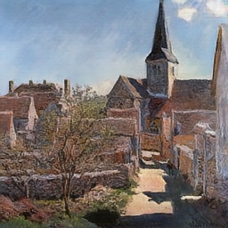
</td>
<td>
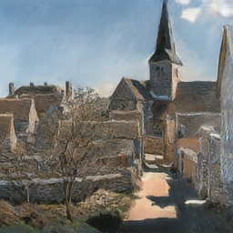
</td>
<td>
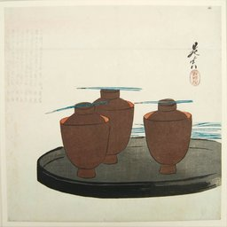
</td>
<td>
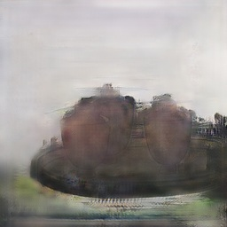
</td>
<td>
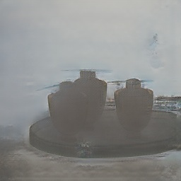
</td>
</tr>

<tr>
<td>

</td>
<td>
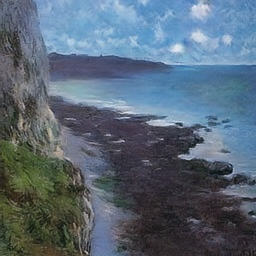
</td>
<td>
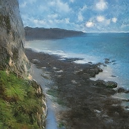
</td>
<td>
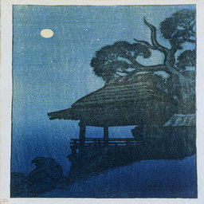
</td>
<td>
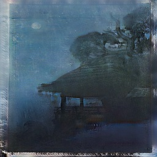
</td>
<td>
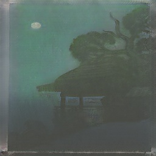
</td>
</tr>

<tr>
<td>

</td>
<td>
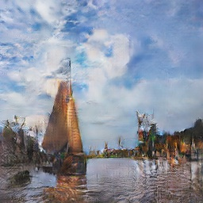
</td>
<td>
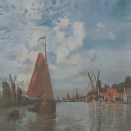
</td>
<td>
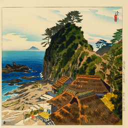
</td>
<td>
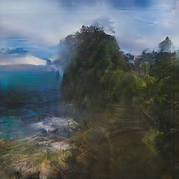
</td>
<td>
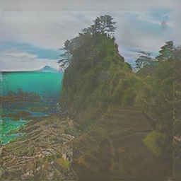
</td>
</tr>

</table>

### Results of comparison with original image and generated image

* Images generated by joint training is more similar to original image (before transformation) than images generated by separate training.

<table border=1>
<tr>
<td rowspan="2" width="20%">
Direction
</td>
<td colspan="2" width="25%">
Average Normalized Root Mean Squared Error (NRMSE)
</td>
<td colspan="2" width="25%">
Average Structural Similarity (SSIM)
</td>
<td colspan="2" width="30%">
Average Peak Signal to Noise Ratio (PSNR)
</td>
</tr>

<tr>
<td>
Separate Training Result
</td>
<td>
Joint Training Result
</td>
<td>
Separate Training Result
</td>
<td>
Joint Training Result
</td>
<td>
Separate Training Result
</td>
<td>
Joint Training Result
</td>
</tr>

<tr>
<td>
Photo → Monet
</td>
<td>
0.48305
</td>
<td>
0.40820
</td>
<td>
0.60085
</td>
<td>
0.64958
</td>
<td>
15.04125
</td>
<td>
16.65931
</td>
</tr>

<tr>
<td>
Monet → Photo
</td>
<td>
0.27763
</td>
<td>
0.23094
</td>
<td>
0.56510
</td>
<td>
0.66007
</td>
<td>
17.01749
</td>
<td>
18.35891
</td>
</tr>

<tr>
<td>
Photo → Ukiyo-e
</td>
<td>
0.54704
</td>
<td>
0.48520
</td>
<td>
0.50736
</td>
<td>
0.53887
</td>
<td>
13.51360
</td>
<td>
14.31872
</td>
</tr>

<tr>
<td>
Ukiyo-e → Photo
</td>
<td>
0.33978
</td>
<td>
0.34216
</td>
<td>
0.48933
</td>
<td>
0.52104
</td>
<td>
13.46210
</td>
<td>
12.95954
</td>
</tr>
</table>


### My thoughts
you can make some comments on the your own homework, e.g. what's the strength? what's the limitation?

#### Pros
- Using many different constraints to make generated results more robust.
	+ Original GAN loss for generator and discriminator
	+ Cycle-consistent loss for forward and backward cycles
	+ Identity mapping loss for real samples
	+ Bi-backward MMD loss for matching distribution between domains when joint training with additional constraint

#### Cons
- Transferring images with certain artistic style into real photos (painting → landscape photographs) is still challenging.
	+ Especially Ukiyo-e case (portrait painting → landscape photographs), since images with Ukiyo-e style usually contain unique style of figures (portraits).

- If applying for multiple modalities by constructing Multi-CycleGANs, need to train a very large model.
	+ Instead, Auxiliary Classifier CycleGANs (StarGAN [4])
		* Generate images by given certain condition (information) for certain domain
		* Discriminate real/fake images and Classify images belonging to which domain (condition)


### Reference

[1] [Unpaired Image-to-Image Translation using Cycle-Consistent Adversarial Networks](https://arxiv.org/pdf/1703.10593.pdf)

[2] [Unpaired Image-to-Image Translation using Cycle-Consistent Adversarial Networks - Project Page](https://junyanz.github.io/CycleGAN/)

[3] [CycleGAN-TensorFlow](https://github.com/vanhuyz/CycleGAN-TensorFlow)

[4] [StarGAN: Unified Generative Adversarial Networks for Multi-Domain Image-to-Image Translation](https://arxiv.org/pdf/1711.09020.pdf)
