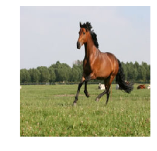
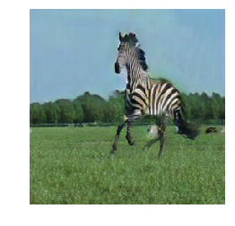
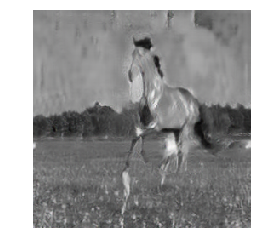
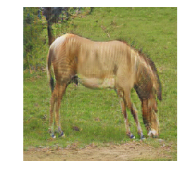
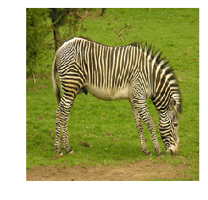
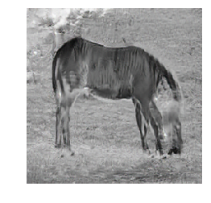
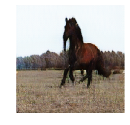
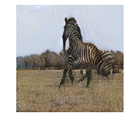
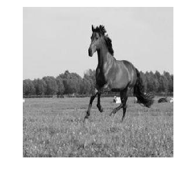

# Homework4 report
106062577 翁正欣

### What scenario do I apply in?
dataset: `wild horse` and `zebra` from ImageNet  
domainA: horse  
domainB: zebra  
domainC: horse converted to grayscale

### What do I modify?
I did't not modify CycleGAN to bi-cycleGAN, just train them seperately.  
most of code come from [here](https://github.com/xhujoy/CycleGAN-tensorflow)   
Two cycle:  
A(horse) <-> B(zebra)  
A(horse) <-> C(grayscale)

#### implementation
I split horse dataset into 3 parts. First part is converted to grayscale and trained with second part (A' <-> C), third part is trained with zebra dataset (A' <-> B). By doing this, dataset in different cycle are unpaired.  

### Qualitative results
|   |horse(A)|zebra(B)|gray(C)|
|---|---|---|---|
|A to B, A to C|gt|||
|B to A, A to C||gt||
|C to A, A to B|||gt|


### My thoughts
I think that these can be applied into some application such as photoshop to make interesting effect. The shortcoming is that it needs lots of time to get it work.

### Training
#### Download a dataset (e.g. zebra and horse images from ImageNet):
```
bash ./download_dataset.sh horse2zebra
```
#### convert data
`convert_data.ipynb`: notebook that split horse dataset and convert to grayscale.  
##### Train model
```
CUDA_VISIBLE_DEVICES=0 python main.py --dataset_dir=horse2zebra2
CUDA_VISIBLE_DEVICES=1 python main.py --dataset_dir=horse2gray
```
#### Test model
`demo.ipynb`: notebook demo how to convert between domains.
### Reference
https://github.com/xhujoy/CycleGAN-tensorflow
