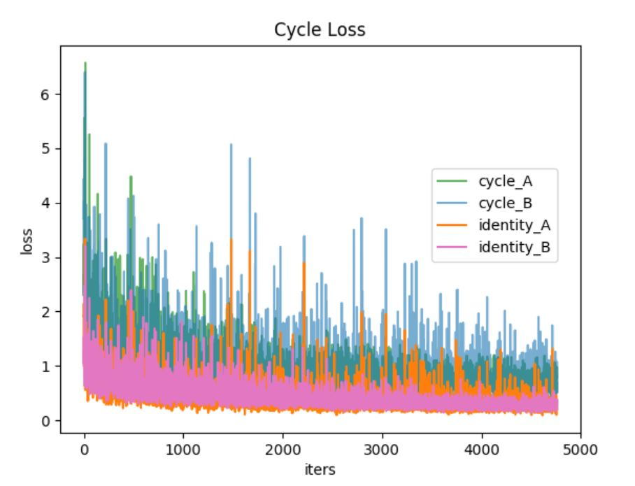
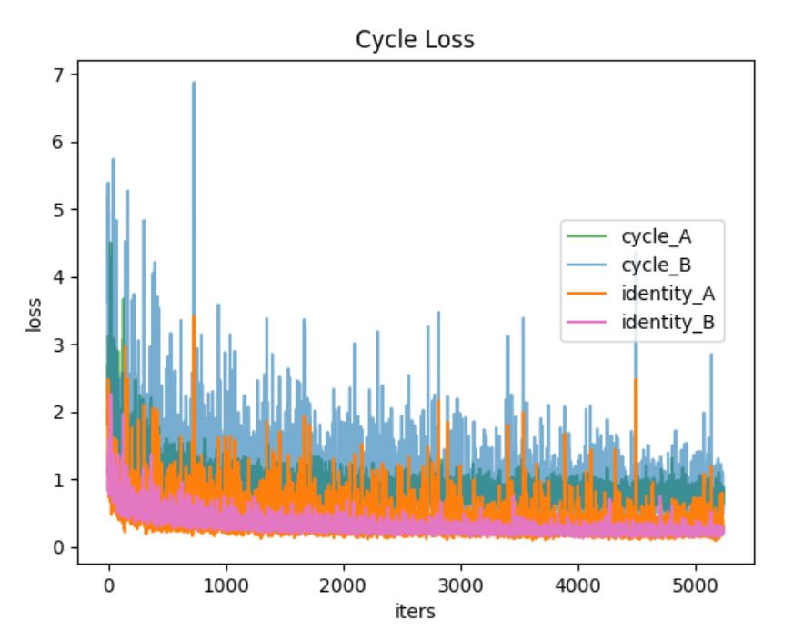
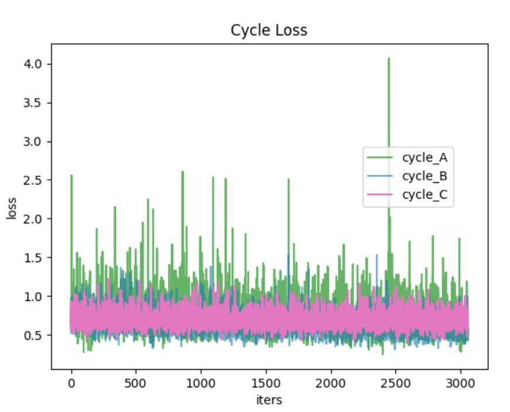
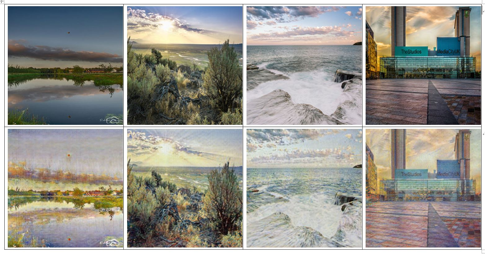
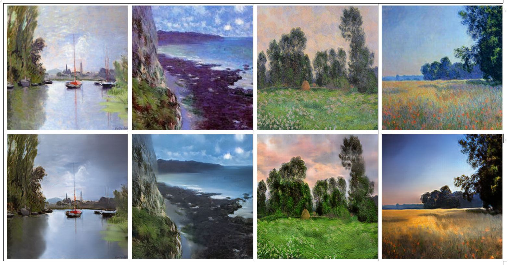
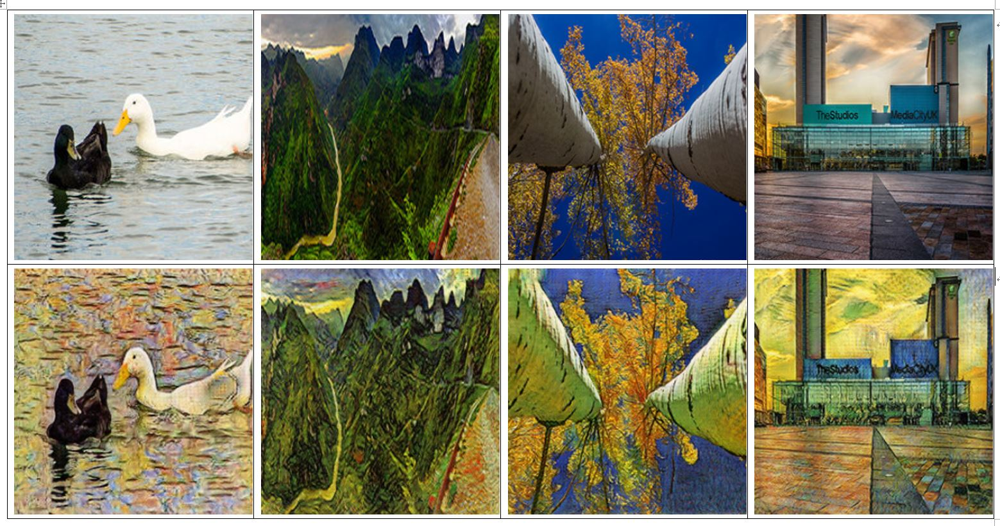
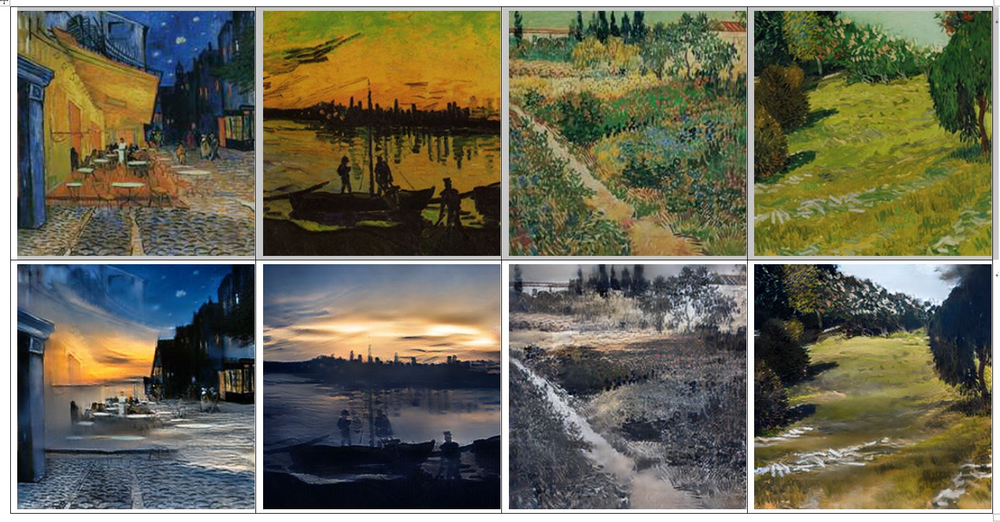
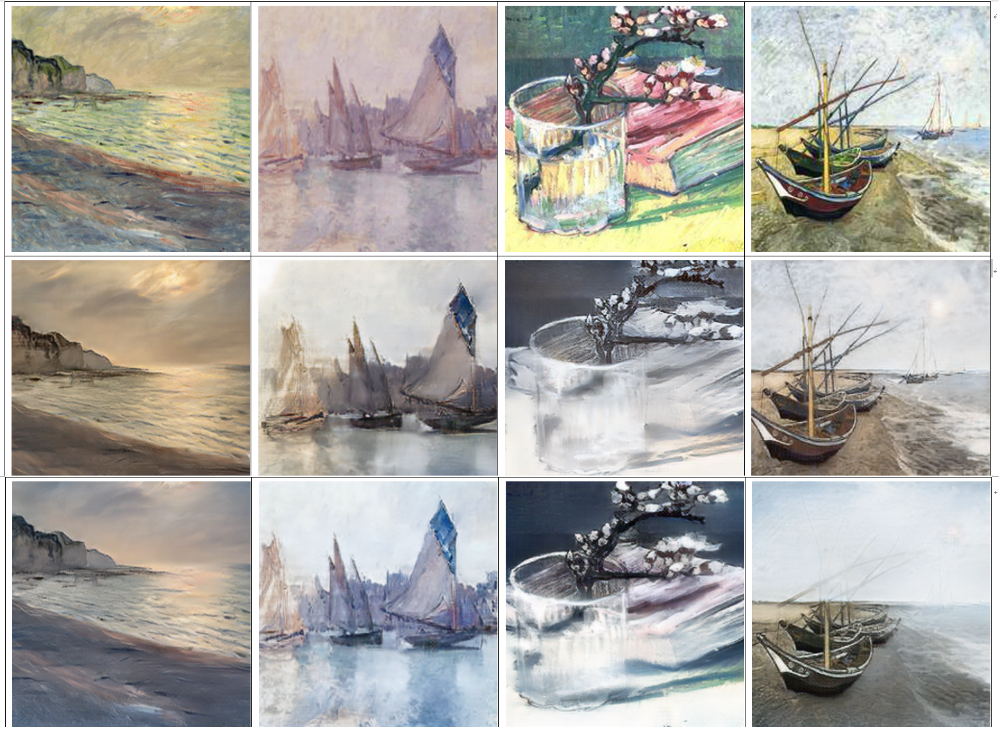

# Homework4 report
## 105061528 陳玉亭
 
### scenario I apply in
I use the dataset 'photo' as the common domain and 'monet' and 'vangogh' as other two domains. First, I use original CycleGAN to train 'photo' ←→ 'monet' and 'photo' ←→ 'vangogh' separately. And then combine these two cycles to jointly train.

### modify 
For the two cycles mentioned above, we have two generaters in each cycle G_ab (G_ac) and G_ba (G_ca) and also have two discriminaters D_a (D_a') and D_b (D_c). Sine domain A is common, I share the disciminater D_a = D_a' for these two cycles for joint training. I use the pre-trained weights from separated cycleGAN for finetuning. It leads to different results from separated training.  

#### tranning curves
From left to right are cycle-losses for (A)'photo' ←→ 'monet', (B)'photo' ←→ 'vangogh' and (C) bi-cycleGAN which is fintune from weights of (A)(B) at 50 epoches. 

(A)
(B)
(C)
### Qualitative results
#### (1) photo ←→ monet  
This block shows photo -> monet (first row is real image set and the second row is generated). 

This block shows monet -> photo (first row is real image set and the second row is generated). 

#### (2) photo ←→ vangogh  
This block shows photo -> vangogh (first row is real image set and the second row is generated). 

This block shows vangogh -> photo (first row is real image set and the second row is generated). 

#### (3) bi-cycleGAN
First row shows real paintings (monet: left two and vangogh: right two). The second row shows results (fake photo) genrated by cycleGAN model and last row shows results (fake photo) genrated by bi-cycleGAN model.   

### My thoughts 
(1) Some images fail if the target domain is lack of such type of images, e.g. Many indoor objects or human are presented in Van Gogh's painting but very few of such examples in 'photo' dataset. It fails if we transfer a indoor sence painted by Van Gogh to a fake photo. I think the problem can be solved by adding more indoor scene images into our 'photo' dataset.   
(2) The generated photo reserve parts of original painting's style. Photos transferred by 'Vangogh' are more lighter and colorful, but they become normal as true photos by using bi-cycleGAN. I guess that is effected from joint training, since the discriminater learns more fake examples.            

### Reference
Pytorch code of CycleGAN from [https://github.com/junyanz/pytorch-CycleGAN-and-pix2pix](https://github.com/junyanz/pytorch-CycleGAN-and-pix2pix "source code")

CycleGAN paper reference: [https://arxiv.org/pdf/1703.10593.pdf](https://arxiv.org/pdf/1703.10593.pdf "cycleGAN paper") 
