# Homework4 report

## Bi-Cycle GAN (and cyle GAN[1]): multiple-domain scenarios


### 105061583 賴承薰


## Scenario

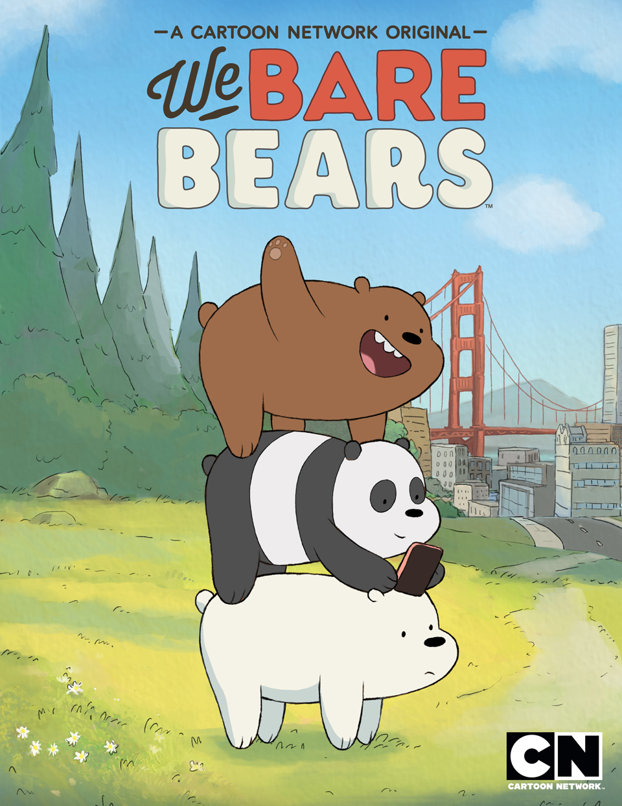

#### ↑ Inspired by this cartoon show

Domain A: Giant panda bear
> About 800 Pictures, manually captured from flickr

Domain B: Polar bear
> Data are obtained from the database AWA2[2]

Domain C: Grizzly bear
> Same as domain B


## Modifying 

### Environment construction
* python 2.7
* pytorch 0.2.0_3 (macOS or Linux)

   installation tutorial: `http://pytorch.org/`
* CUDA


Simply copy and append the part with domain B and modifd into C.

for instance:

```
def backward_D_AB(self):
    fake_B = self.fake_B_pool.query(self.fake_B)
    loss_D_AB = self.backward_D_basic(self.netD_AB, self.real_B, fake_B)
    self.loss_D_AB = loss_D_AB.data[0]

def backward_D_AC(self):
    fake_C = self.fake_C_pool.query(self.fake_C)
    loss_D_AC = self.backward_D_basic(self.netD_AC, self.real_C, fake_C)
    self.loss_D_AC = loss_D_AC.data[0]

def backward_D_B(self):
    fake_AB = self.fake_A_pool.query(self.fake_AB)
    loss_D_B = self.backward_D_basic(self.netD_B, self.real_A, fake_AB)
    self.loss_D_B = loss_D_B.data[0]

def backward_D_C(self):
    fake_AC = self.fake_A_pool.query(self.fake_AC)
    loss_D_C = self.backward_D_basic(self.netD_C, self.real_A, fake_AC)
    self.loss_D_C = loss_D_C.data[0]

```

and the generative loss became

```
loss_G = loss_G_AB + loss_G_AC+ loss_G_B + loss_G_C
          + loss_cycle_AB + loss_cycle_AC + loss_cycle_B + loss_cycle_C
          + loss_idt_AB + loss_idt_AC + loss_idt_B + loss_idt_C
```

Most of the differene are modified in the file `./models/cycle_gan.py` and `./data/unaligned_dataset.py`
I don't think my way is the best way to tackle the Bi-cycle training.
There must be someone who can propose a much better method.

## Qualitative results

### Ordinary cycle GAN

#### Epoch 50

<table border=1>
  <tr>
     <td align="center">
      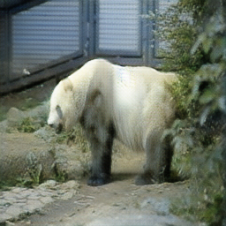
      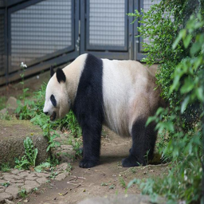
    </td>
   <td align="center">
    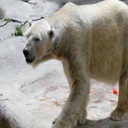
    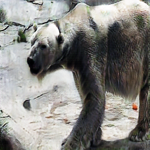  
  </td>
</tr>
<tr>
   <td align="center">
    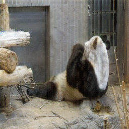
    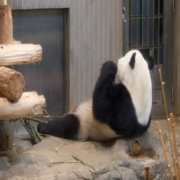
  </td>
   <td align="center">
    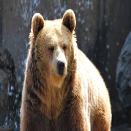
      
  </td>
</tr>
<table>


#### Epoch 100

<table border=1>
  <tr>
    <td align="center">
      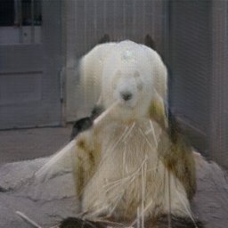
      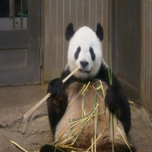
    </td>
     <td align="center">
      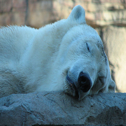
      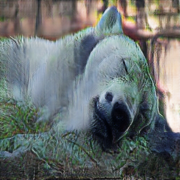  
    </td>
  </tr>
  <tr>
     <td align="center">
      
      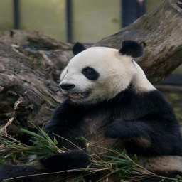
    </td>
     <td align="center">
      
        
    </td>
  </tr>
</table>

#### Epoch 150

<table border=1>
  <tr>
     <td align="center">
      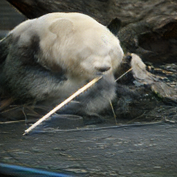
      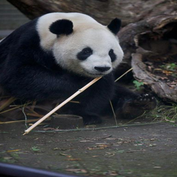
    </td>
     <td align="center">
      
      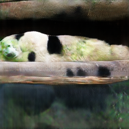  
    </td>
  </tr>
  <tr>
     <td align="center">
      
      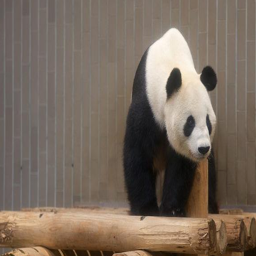
    </td>
     <td align="center">
      
      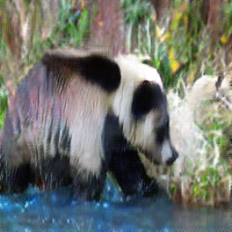  
    </td>
  </tr>
</table>

#### Epoch 200

<table border=1>
  <tr>
    <td align="center">
      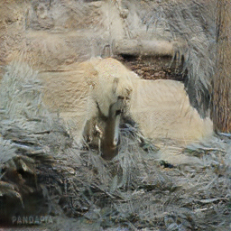
      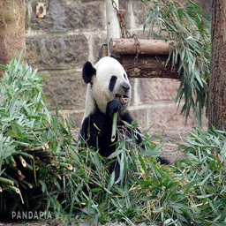
    </td>
    <td align="center">
      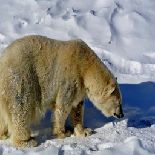
      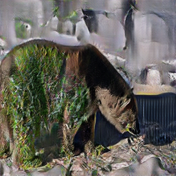  
    </td>
  </tr>
  <tr>
    <td align="center">
      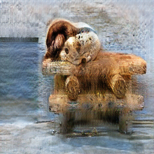
      
    </td>
    <td align="center">
      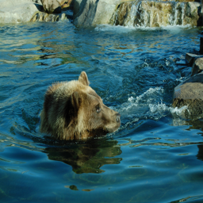
        
    </td>
  </tr>
</table>

##### Some execellent results
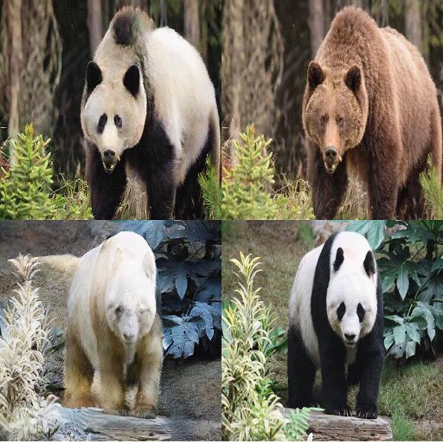

### Super imperfect Bi-cycle GAN

#### Epoch 50

<table border=1>
  <tr>
    <td align="center">
        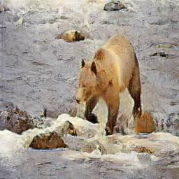
        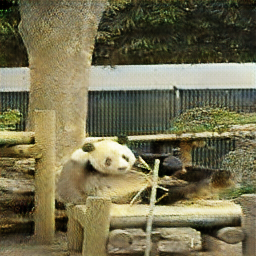
    </td>
    <td align="center">
        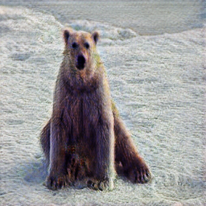
        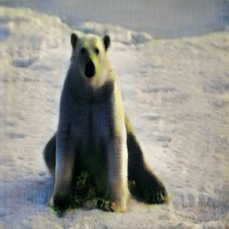  
    </td>
  </tr>
  <tr>
    <td align="center">
        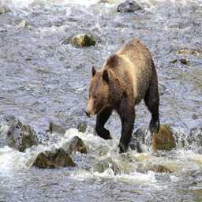
        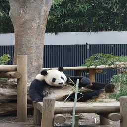
    </td>
    <td align="center">
         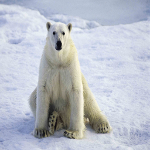
    </td>
  </tr>
</table>

#### Epoch 100

<table border=1>
  <tr>
    <td align="center">
        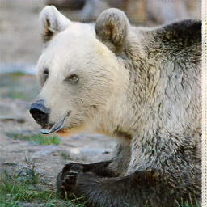
        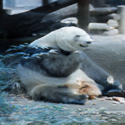
    </td>
    <td align="center">
        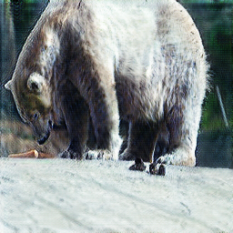
        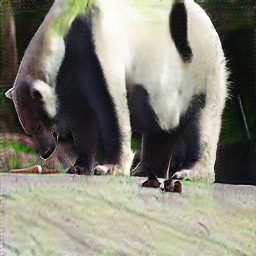  
    </td>
  </tr>
  <tr>
    <td align="center">
        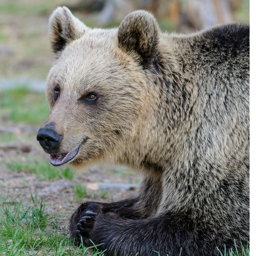
        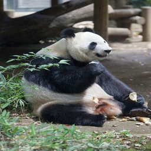
    </td>
    <td align="center">
         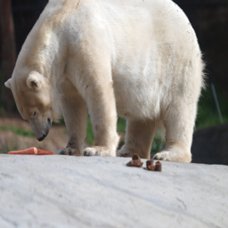
    </td>
  </tr>
</table>

#### Epoch 150

<table border=1>
  <tr>
    <td align="center">
        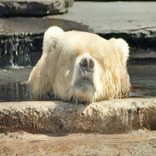
        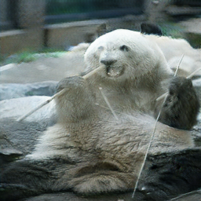
    </td>
    <td align="center">
        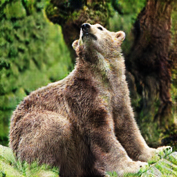
        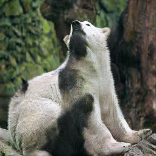  
    </td>
  </tr>
  <tr>
    <td align="center">
        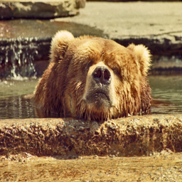
        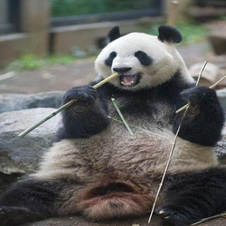
    </td>
    <td align="center">
         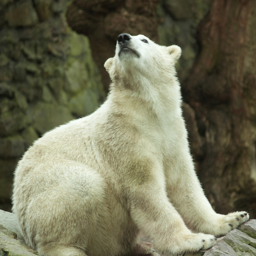
    </td>
  </tr>
</table>

#### Epoch 200

<table border=1>
  <tr>
    <td align="center">
        
        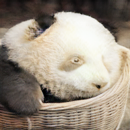
    </td>
    <td align="center">
        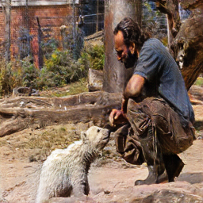
        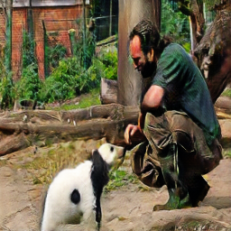  
    </td>
  </tr>
  <tr>
    <td align="center">
        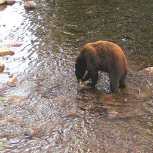
        
    </td>
    <td align="center">
         
    </td>
  </tr>
</table>


### My thoughts 

Most of features learned by my GANs focus on face, neither traditional cycle GAN nor modified BiCycle GAN.
But Panda bear's body parts are also discriminative.
Such a pity that the dataset I collected is not various and noiseless enough for the network to learn better features.
And I think Bicycle GAN might sound simple in concept but not so easy on code modifying and implementation.
My result sucks.
Perhaps the combination constraint had limited the generator that we cannot obtain ideal result.


### Reference
[1] Unpaired Image-to-Image Translation using Cycle-Consistent Adversarial Networks 
Jun-Yan Zhu∗ Taesung Park∗ Phillip Isola Alexei A. Efros, Berkeley AI Research (BAIR) laboratory, UC Berkeley
https://arxiv.org/pdf/1703.10593.pdf

[2] animals with attributes 2 A free dataset for Attribute Based Classification and Zero-Shot Learning
Christoph H. Lampert, Daniel Pucher, Johannes Dostal
https://cvml.ist.ac.at/AwA/
