# Homework4 report

### What scenario do I apply in?
I downloaded the datasets from Imagenet ([Orange](http://www.image-net.org/synset?wnid=n07747607), [Tangerine](http://www.image-net.org/synset?wnid=n07748416), [Grapefruit](http://www.image-net.org/synset?wnid=n07749969)).
| Orange | Tangerine | Grapefruit |
|:-----:|:---:|:----:|
| 1444 | 1219 | 1188 |
|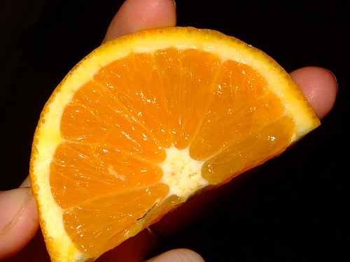|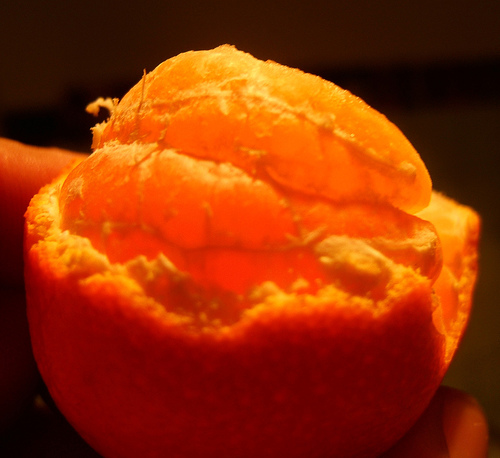|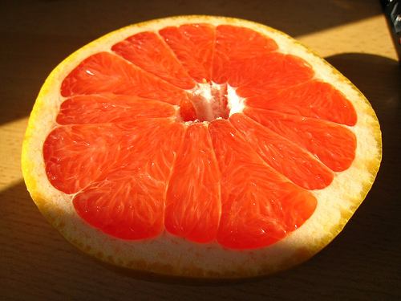|
At first glance, an orange, a tangerine, and a grapefruit look very similar. All are orange in color, and grow on trees. (All are varieties of citrus fruit). For the untrained eyes, it can be  very confusing. While there are still some differences that allow people to tell them apart. After a human beings learned the characteristics of the orange, the tangerine, and the grapefruit, they would not be easily fooled again. How about GAN? We all know that a trained GAN can generate realistic images, but can GAN discover the difference and learn the pattern?

### What do I modify? 
Basically concatenate two CycleGANs, and modify the loss function. (Code mostly borrowed from [this](https://github.com/vanhuyz/CycleGAN-TensorFlow) Tensorflow implementation of CycleGAN.)

In CycleGANs, they introduce two cycle consistency losses that capture the intuition that if
we translate from one domain to the other and back again we should arrive at where we started.
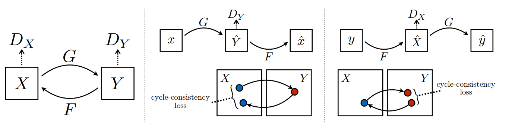
More specifically, the two losses are `forward cycle-consistency loss` and `backward cycle-consistency loss`.
1. forward cycle-consistency loss: x → G(x) → F(G(x)) ≈ x
2. backward cycle-consistency loss: y → F(y) → G(F(y)) ≈ y

In the original paper, the `total cycle loss` is defined as:
```python
loss = self.lambda1*forward_loss + self.lambda2*backward_loss
```
which is the sum of two L1 normalized loss(forward_loss amd backward_loss).

In homework 4, we have to train to cycles separately and jointly.
Just like the `cycle consistency` in CycleGAN, we have to add constraints on the consistency of the shared domain (Which is domain `Y`). As the table shown below, I integrate the `xy_Backward` loss and `yz_Forward` loss together as our special `bi-cycle-loss`. So that shared domain `Y` keeps the transform between `X` to `Z` adversarial. 

| Separate Cycles | Joint Cycles |
|:-----:|:---:|
|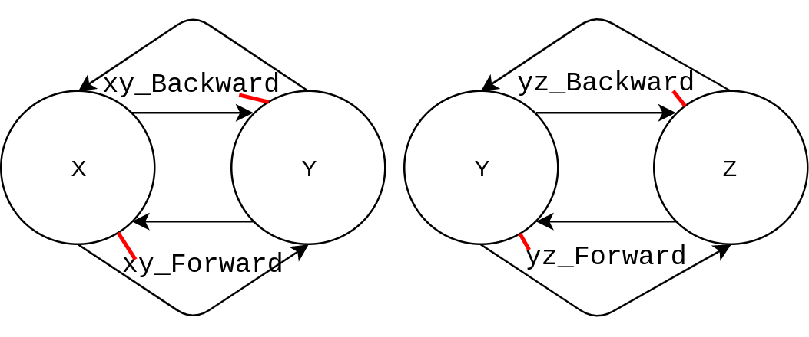|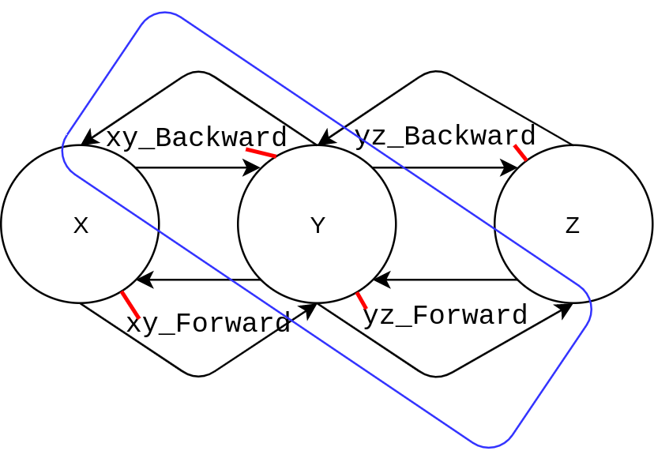|

Noted that I ignored the `identity loss`(introduced in the origin which encourages the mapping to preserve color composition between the input and output). It might be helpful in painting→photos, but didn't seem to affect in my scenario data.


### Qualitative results
<table border=1>
<tr>
<td colspan="3">
Orange2Tangerine
</td>
<td colspan="3">
Tangerine2Grapefruit
</td>
</tr>

<tr>
<td>
Input
</td>
<td>
Separate
</td>
<td>
Joint
</td>
<td>
Input
</td>
<td>
Separate
</td>
<td>
Joint
</td>
</tr>

<tr>
<td>
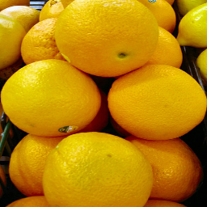
</td>
<td>
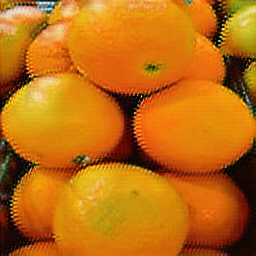
</td>
<td>
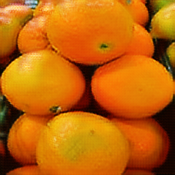
</td>
<td>
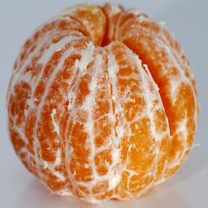
</td>
<td>
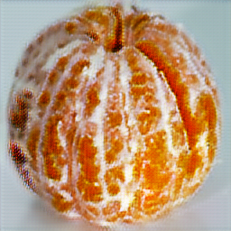
</td>
<td>
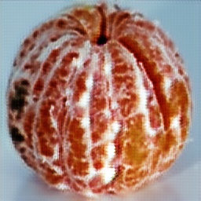
</td>
</tr>

<tr>
<td>

</td>
<td>
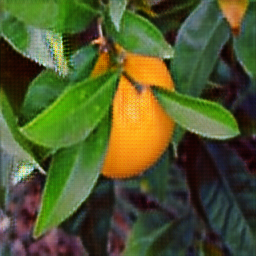
</td>
<td>
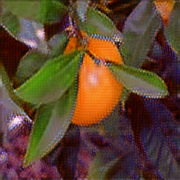
</td>
<td>

</td>
<td>
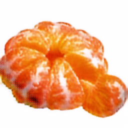
</td>
<td>
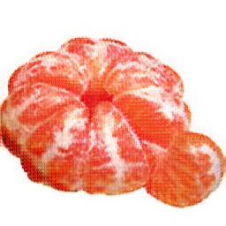
</td>
</tr>

<tr>
<td>
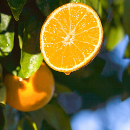
</td>
<td>
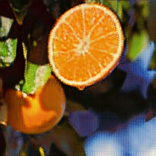
</td>
<td>
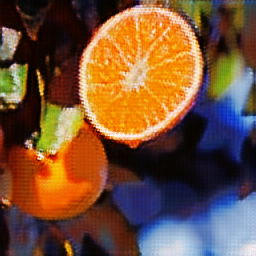
</td>
<td>
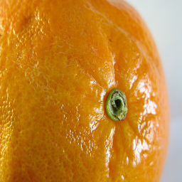
</td>
<td>
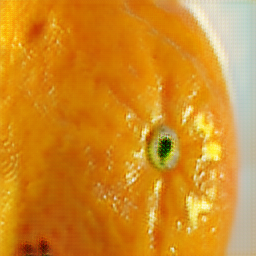
</td>
<td>
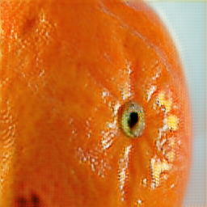
</td>
</tr>


<tr>
<td colspan="3">
Tangerine2Orange
</td>
<td colspan="3">
Grapefruit2Tangerine
</td>
</tr>

<tr>
<td>
Input Image
</td>
<td>
Separate
</td>
<td>
Joint
</td>
<td>
Input
</td>
<td>
Separate
</td>
<td>
Joint
</td>
</tr>

<tr>
<td>
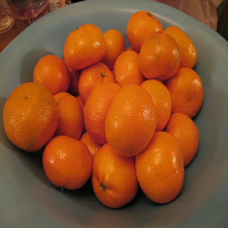
</td>
<td>
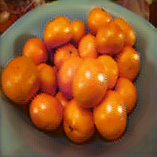
</td>
<td>
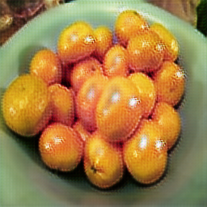
</td>
<td>
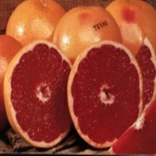
</td>
<td>
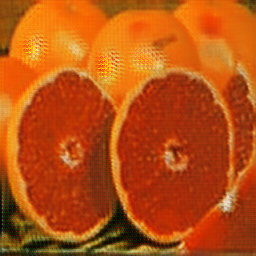
</td>
<td>
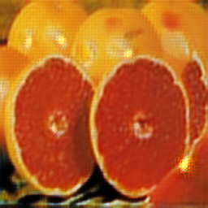
</td>
</tr>

<tr>
<td>

</td>
<td>
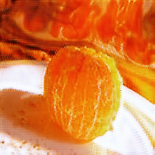
</td>
<td>
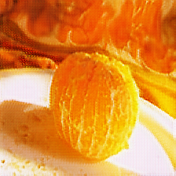
</td>
<td>
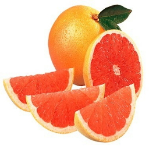
</td>
<td>
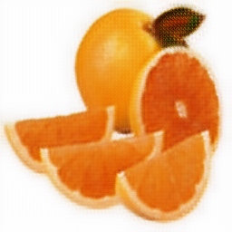
</td>
<td>
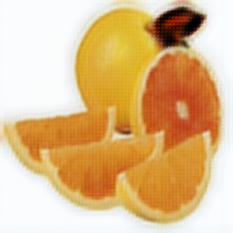
</td>
</tr>

<tr>
<td>
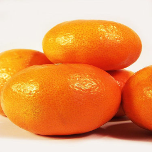
</td>
<td>
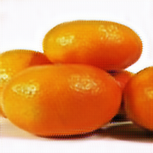
</td>
<td>
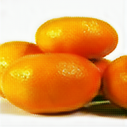
</td>
<td>

</td>
<td>
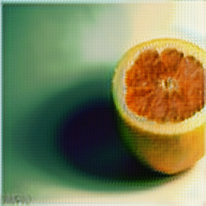
</td>
<td>
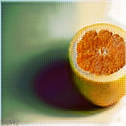
</td>
</tr>

</table>

### My thoughts 
To be honest, I think `Orange`, `Tangerine`, and `Grapefruit` are not an ideal scenerio. Though `Tangerine` may play a good role as share domain `Y`. But the problem is that I found out that there are some data even a human cannot tell diffence. For example, `Mandarins` are a type of `orange` and the overarching category that `Tangerines`, `Clementines`, and `Satsumas` fall into. 

Though the dataset mayhave some flaws, it's still apparently that training two cycles jointly has better result than training seperately. Maybe I should try `StarGan` and compare the results.
