# Homework4 report
高穎 106062525

### What scenario do I apply in?

Cycle GAN 可以做到兩個domain之間的轉換,這次實作的Bi-Cycle GAN可以做到三個domain之間的轉換

A->B 將衛星地圖轉換成google地圖

A->C 將衛星地圖轉化成圖畫的風格

### What do I modify? 
you can show some snippet

在原本Cycle GAN的基礎上,加入第三個Domain的資訊.包含dataset的路徑,A到C的generator,以及C到A的generator,以及discriminator,lossfunction等等

        
        # GAN loss D_A(G_AC(A))
        fake_C = self.netG_AC(self.real_A)
        pred_fake = self.netD_AC(fake_C)
        loss_G_AC = self.criterionGAN(pred_fake, True)
        
        # Forward cycle loss
        rec_AC = self.netG_C(fake_C)
        loss_cycle_AC = self.criterionCycle(rec_AC, self.real_A) * lambda_AC
        
        loss_G = loss_G_A + loss_G_B + loss_cycle_A + loss_cycle_B + loss_idt_A + loss_idt_B + loss_G_AC + loss_G_C +          
                 loss_cycle_AC + loss_cycle_C + loss_idt_AC + loss_idt_C

### Qualitative results

Cycle GAN : A->B, A:1096 images, B:1096 images

| Domain | real A | fake B | real B | fake B |
| :----: | :-----:| :----: | :----: | :----: | 
| A->B |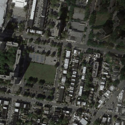|  |  | 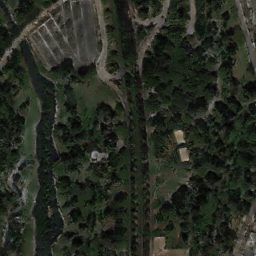 |
| A->B || 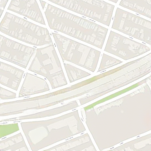 | 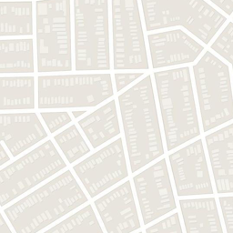 | 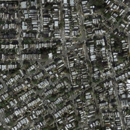 |

Cycle GAN : A->C, A:1096 images, C:6288 images

| Domain | real A | fake C | real C | fake A |
| :----: | :-----:| :----: | :----: | :----: | 
| A->C |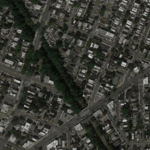| 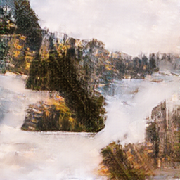 | 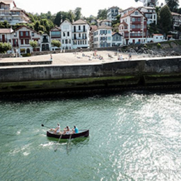 | 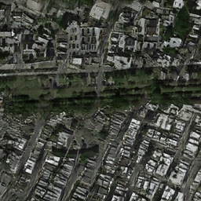 |
| A->C |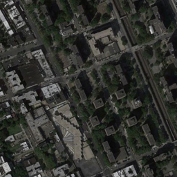| 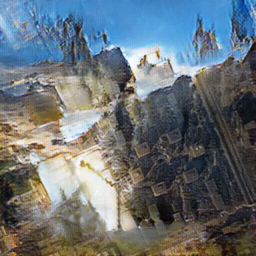 | 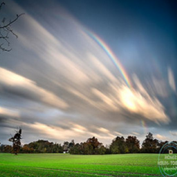 |  |

Bi-Cycle GAN : A->B and A->C, A:832 images, B:875 images, C:822 images

| Domain | real A | fake B | real B | fake A | real A | fake C | real C | fake A |
| :----: | :-----:| :----: | :----: | :----: | :----: | :----: | :----: | :----: |
| A->B and A->C || 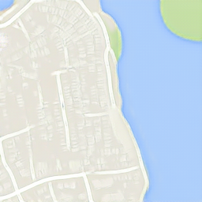 | 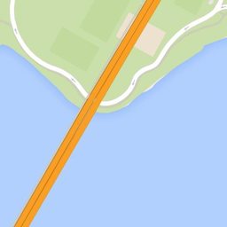 | 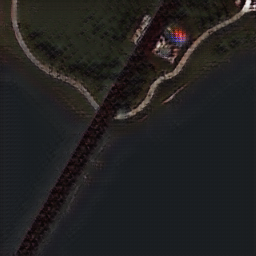 |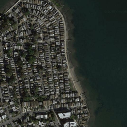| 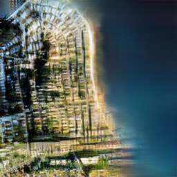 |  |  |
| A->B and A->C ||  | 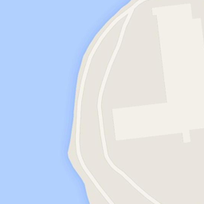 | 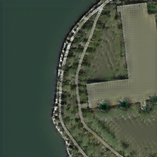 |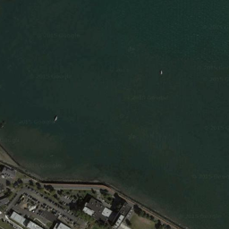| 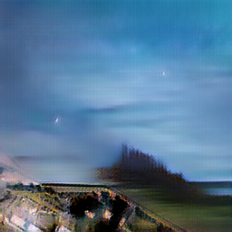 | 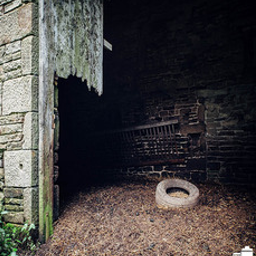 |  |

### My thoughts 
因為一開始train時沒想那麼多,所以C dataset的大小超大,在Bi-Cycle-GAN training的時候因為時間以及資源不足,所以把dataset全部縮小了.

因此導致我覺得Bi-Cycle-GAN的效果沒有分開training來得好.如果有時間希望可以在公平的條件下對比兩者的效能

因為我挑了個原本地圖比較不相干的domain C, 因此產生了許多我覺得很有趣的圖片,在有原本地圖特徵的情況下畫出了一幅還不錯的藝術作品,覺得GAN真的有十分有趣的功能.

### Others
dataset https://drive.google.com/file/d/19e7dKNntRJJ3DD_wUCiTWnsEVV0eRDCF/view?usp=sharing

### Reference
J.-Y. Zhu, T. Park, P. Isola, and A. A. Efros. Unpaired image-to-image translation using cycle-consistent adversarial networks. In ICCV, 2017.
https://github.com/junyanz/pytorch-CycleGAN-and-pix2pix
