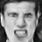
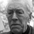

# Homework4 report

### What scenario do I apply in?
I want to change human facial expressions, such as smile to sad.
 
**A: angry face   B: smile face   C: serious face**  
* Cycle 1: A <-> B    
* Cycle 2: B <-> C  

Dataset is from [FER2013](https://github.com/Microsoft/FERPlus)
### What do I modify? 
* Use Cycle-GAN from https://github.com/xhujoy/CycleGAN-tensorflow to train two seperate cycles.
* Bi-Cycle-GAN still working on  

### Qualitative results
* Cycle 1
  * good result  
      
    |real A|fake B|real B|fake A|
    |----|----|----|----|
    |||||
    |||||
 
  * fail result  
     
    |real A|fake B|real B|fake A|
    |----|----|----|----|
    |||||
    |||||
    
* Cycle 2
  * good result  
      
    |real C|fake B|real B|fake C|
    |----|----|----|----|
    |||||
    |||||
 
  * fail result  
     
    |real C|fake B|real B|fake |
    |----|----|----|----|
    |||||
    |||||

### My thoughts 
It is hard for using CycleGAN to do this task. Sometimes it just not change the facial expresssion, it also add something like bread, hair on original face. Maybe we can add some constraints or conditions to help training. Or, maybe Bi-Cycle GAN will do better.    

### Reference
* [CycleGAN](https://arxiv.org/abs/1703.10593)
* [FER2013](https://github.com/Microsoft/FERPlus)  
* [CycleGAN-tensorflow](https://github.com/xhujoy/CycleGAN-tensorflow)  
