# Homework4 report

### What scenario do I apply in?

I would like to transfer following domains:

1. `Suit` to `Shirt`
2. `Shirt` to `Jacket`

Here are some samples:

<table>
    <tr>
        <td>SUIT</td>
        <td>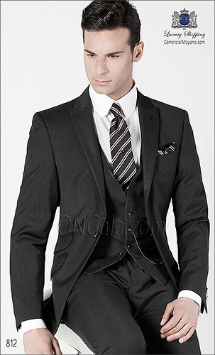</td>
        <td>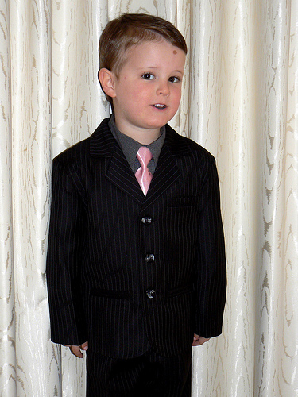</td>
        <td>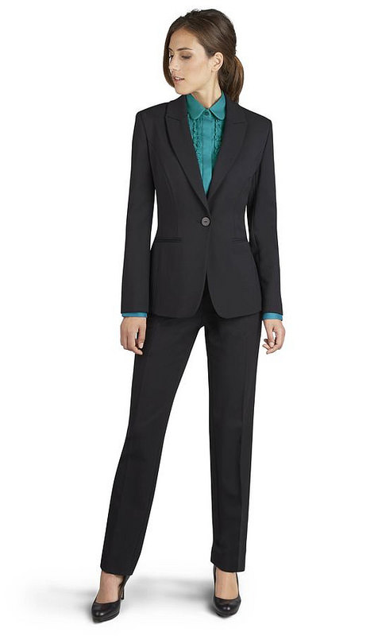</td>
    </tr>
    <tr>
        <td>SHIRT</td>
        <td>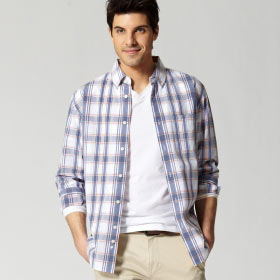</td>
        <td>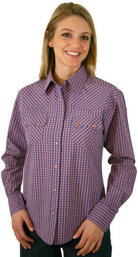</td>
        <td>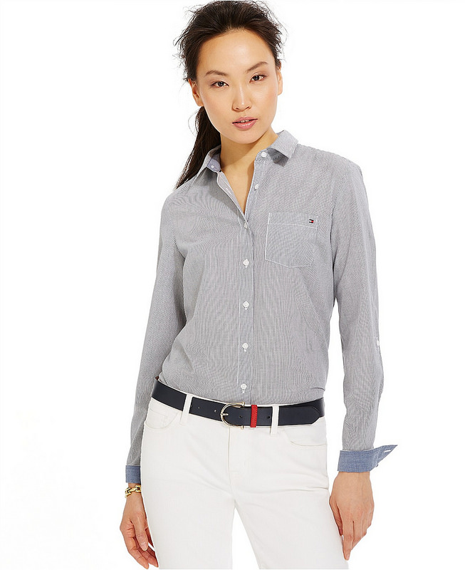</td>
    </tr>
    <tr>
        <td>JACKET</td>
        <td>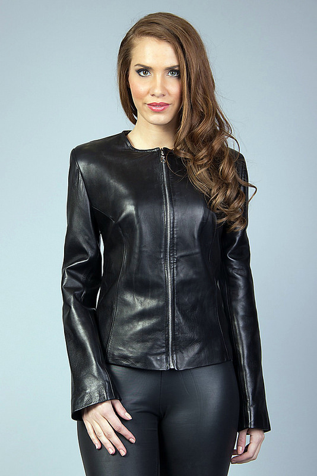</td>
        <td>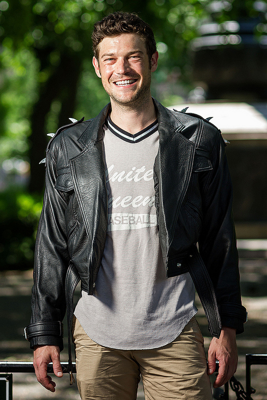</td>
        <td>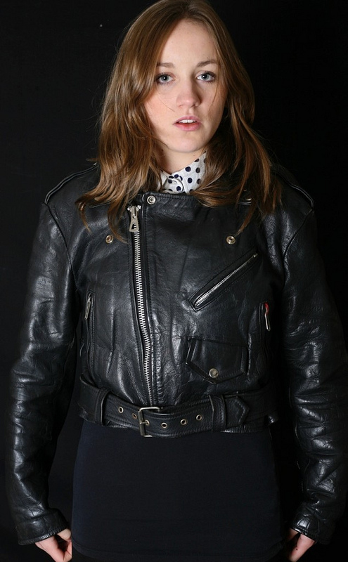</td>
    </tr>
</table>

### Qualitative results

<table>
    <tr>
        <td>SUIT to SHIRT</td>
        <td>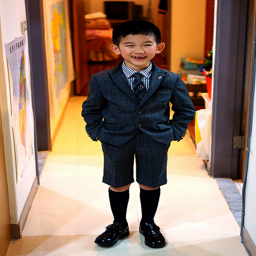</td>
        <td>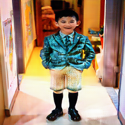</td>
    </tr>
    <tr>
        <td>SHIRT to SUIT</td>
        <td>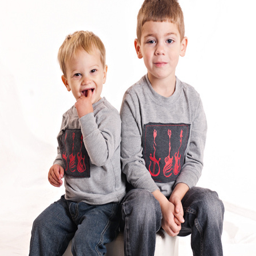</td>
        <td>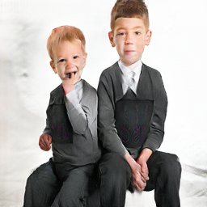</td>
    </tr>
    <tr>
        <td>SHIRT to JACKET</td>
        <td>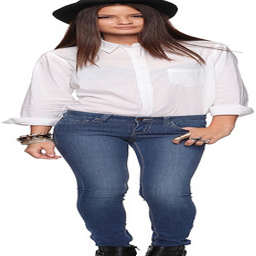</td>
        <td>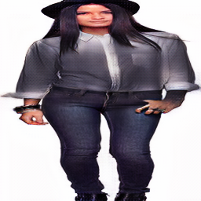</td>
    </tr>
    <tr>
        <td>JACKET to SHIRT</td>
        <td>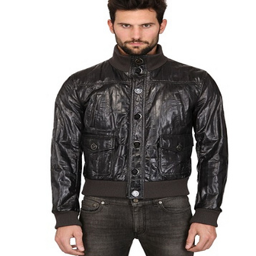</td>
        <td>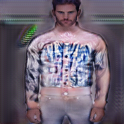</td>
    </tr>
</table>

### My thoughts 

In this homework the first challenge is to collect a lot of qualified dataset for training the CycleGAN, after searching some public data sets online, I failed.
Then I tried to implement a crawler to automatically download images from Flickr which provides convenient API for the purpose.
I downloaded 4000 images for each `shirt`, `suit` and `jacket` category, it was the time to get start training.
But soon I found that it is too slow for training even with a good GPU, finally I get the result on three days later.

From result, it seems CycleGAN cannot turn in the mission, as `shirt`, `suit` and `jacket` have significant different in the shape,
while CycleGAN prefers to transform style, color, texture.

Although CycleGAN has some limitations, it still very interesting, and I am ready to give a try to transform between `black hair`, `blonde hair` and `red hair`,
samples as below:

<table>
    <tr>
        <td>SUIT</td>
        <td>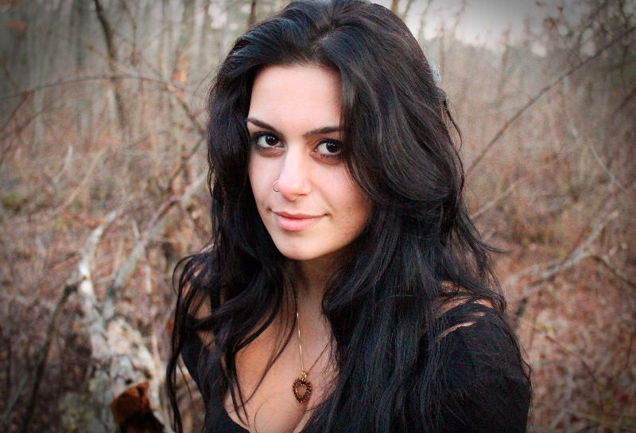</td>
        <td>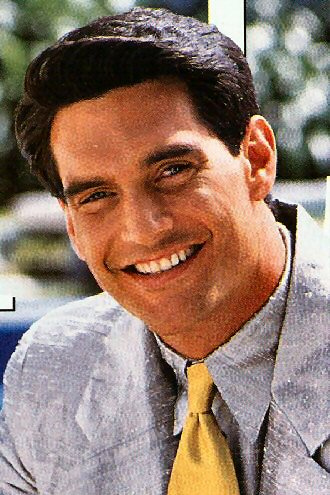</td>
        <td>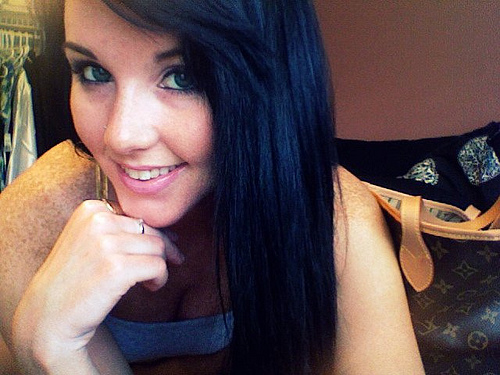</td>
    </tr>
    <tr>
        <td>SHIRT</td>
        <td>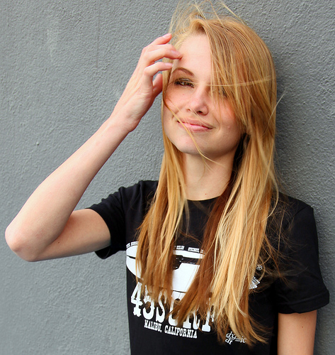</td>
        <td>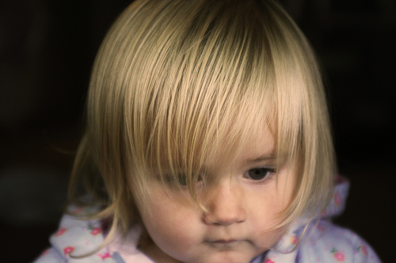</td>
        <td>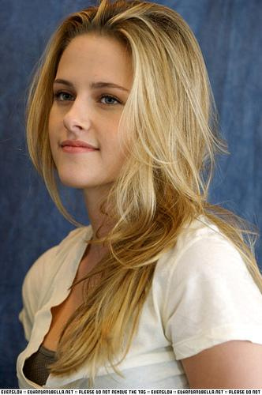</td>
    </tr>
    <tr>
        <td>JACKET</td>
        <td>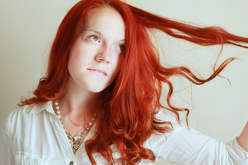</td>
        <td>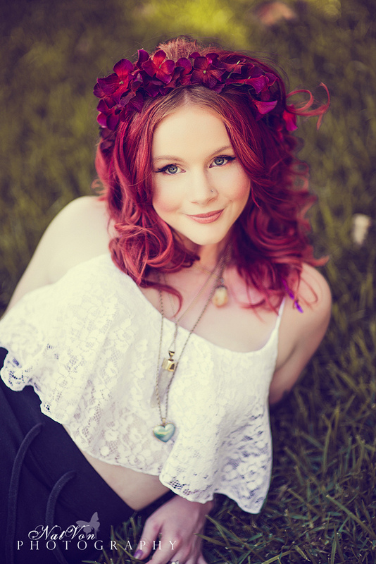</td>
        <td>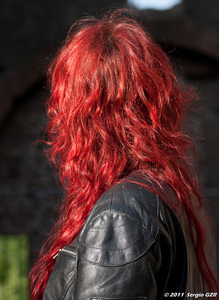</td>
    </tr>
</table>
