# 江愷笙 <span style="color:black">(106062568)</span>

Here is the [github page]() of my report.

# Homework4 report

## Overview

This project is related to
* Jun-Yan Zhu, Taesung Park, Phillip Isola, Alexei A. Efros, "Unpaired Image-to-Image Translation using Cycle-Consistent Adversarial Networks", ICCV 2017
* Jun-Yan Zhu, Richard Zhang, Deepak Pathak, Trevor Darrell, Alexei A. Efros, Oliver Wang, Eli Shechtman, "Toward Multimodal Image-to-Image Translation"
* Yunjey Choi, Minje Choi, Munyoung Kim, Jung-Woo Ha, Sunghun Kim, Jaegul Choo, "StarGAN: Unified Generative Adversarial Networks for Multi-Domain Image-to-Image Translation"

>With CycleGAN, we can better transfer the styles of images from domain A to domain B and vice versa without unpaired data. What will it be if we have two cycles (A, B) and (B, C) where B is the common modality shared by the two cycles?

## Implementation

In this project we have to find a dataset and use the idea of cycle-GAN to do the style transfer. The main idea is to train two cycle-GAN, which is A -> B -> A' and B -> C -> B'. Here I found some interest from "StarGAN: Unified Generative Adversarial Networks for Multi-Domain Image-to-Image Translation", which is a pretty new paper with amazing results. I use one of the dataset which they have used in their work called "CelebA", which collects many different images with people in different style, and label them with 40 attributes such as Black_Hair, Male, Brown_Hair, Pale, Chubby etc. Since each image may have multiple attributes, for example, a people with black is probably a man, so I choose three domain that are Black_Hair, Blond_Hair and Gray_Hair in order to let each image only occur in one domain.

### get_CelebA.py

In order to use the dataset and split it into the three domain I want, I write my own code to read the label and save the image to the related folder.

First we define the image_path and metadata_path.

```python
image_path = '/home/petersci/CycleGAN_TensorFlow/data/CelebA_nocrop/images'
metadata_path = '/home/petersci/CycleGAN_TensorFlow/data/list_attr_celeba.txt'
```
And then we read the attributes in the file and do the shuffling.

```python
lines = open(metadata_path, 'r').readlines()
num_data = int(lines[0])
attr2idx = {}
idx2attr = {}

print ('Start preprocessing dataset..!')

attrs = lines[1].split()
for i, attr in enumerate(attrs):
    attr2idx[attr] = i
    idx2attr[i] = attr

#selected_attrs = ['Black_Hair', 'Blond_Hair', 'Gray_Hair', 'Attractive', 'Bags_Under_Eyes', 'Chubby']
filenames_black = []

lines = lines[2:]
random.shuffle(lines)   # random shuffling
```
Finally, we check if this is the attribute that we want, split it into training and testing data, and save the image to the saving_path.

```python
for i, line in enumerate(lines):

    splits = line.split()
    filename = splits[0]
    values = splits[1:]

    label = []
    for idx, value in enumerate(values):
        attr = idx2attr[idx]

        if attr == 'Black_Hair':
            if value == '1':
                filenames_black.append(os.path.join(image_path, filename))

test_filenames_black = filenames_black[0:int(len(filenames_black)/10)]
train_filenames_black = filenames_black[int(len(filenames_black)/10):]

print('number of training Black_Hair is ', len(train_filenames_black))
print('number of testing Black_Hair is ', len(test_filenames_black))

for idx, path in enumerate(train_filenames_black):
    image = Image.open(path)
    image.save('/home/petersci/CycleGAN_TensorFlow/input/CelebA/Black_Hair/'+str(idx)+'.jpg')

for idx, path in enumerate(test_filenames_black):
    image = Image.open(path)
    image.save('/home/petersci/CycleGAN_TensorFlow/input/CelebA/Black_Hair_test/'+str(idx)+'.jpg')
```

## Installation

### Dependencies

* Tensorflow
* Python3.5

### Getting Started

* For the starter code, I use [Tensorflow implementation of CycleGANs](https://github.com/leehomyc/cyclegan-1) by Harry Yang.
* To get started, first clone the repository and renamed it as CycleGAN_TensorFlow.
* Use `$ bash ./download_datasets.sh horse2zebra` to download horse2zebra dataset for testing.
* Use `$ bash download.sh` to download CelebA.
* To split the data into the domain we want, Use `$ python get_CelebA.py`, and don't forget to change image_path, metadata_path and saving_path in get_CelebA.py to your own directory.
* Use `$ convert '*.jpg[128x128!]' resize%06d.jpg` to resize the image in the folder to the size you want.
* Use `$ for i in $(seq num1 num2); do rm $i.jpg; done` to delete the unresized image.
* Follow the instruction [here](https://github.com/leehomyc/cyclegan-1) for training and testing.
* If you want to test my result, use the checkpoint in "black2blond_ckpt" and "blond2gray_ckpt" and do the testing.

## Results

### Problem 1

Here in problem 1 I train two cycle-GANs separately, which is Black_Hair-to-Blond_Hair and Blond_Hair-to-Gray_Hair. Firstly I resize all the image to 128x128 (at first I use 256x256, however, the error with CUDA_ERROR_OUT_OF_MEMORY will show up). And the batch size is 1. For training, I use 1500 images for each domain; and for testing, I use 200 images respectively.

For black2blond, I trained 100 epochs, and the result looks OK. But for blond2gray, after I trained 100 epochs, there will be some distortion on the human face, the possible reason is that people with gray hair is probably the elder, so this transfer not only change the color of their hair, but also the age the people in the image. And I also find there is some mode collapsing, the generated face are the same. Below shows the qulitative results for the transformation.

#### Cycle1 

A: Black_Hair    B: Blond_Hair

| Input A | Input B | Fake A | Fake B | Cycle A | Cycle B |
| :-----: | :-----: | :----: | :----: | :-----: | :-----: |
| 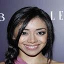 | 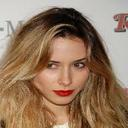 |  | 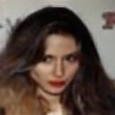 | 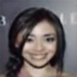 | 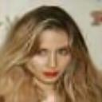 |
| 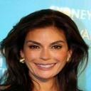 | 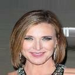 |  | 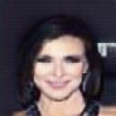 | 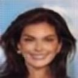 | 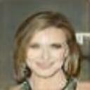 |
| 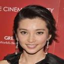 | 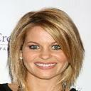 | 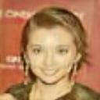 |  | 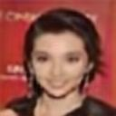 | 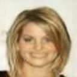 |
| 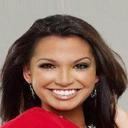 | 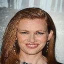 | 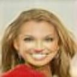 | 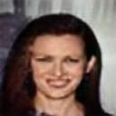 |  | 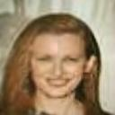 |

#### Cycle2

A: Blond_Hair    B: Gray_Hair

| Input A | Input B | Fake A | Fake B | Cycle A | Cycle B |
| :-----: | :-----: | :----: | :----: | :-----: | :-----: |
| 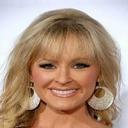 | 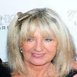 | 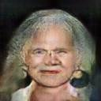 | 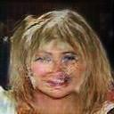 | 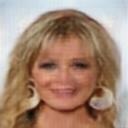 |  |
| 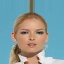 |  |  | 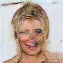 | 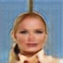 | 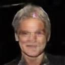 |
|  | 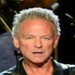 | 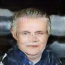 | 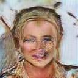 | 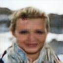 | 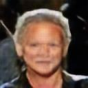 |
|  | 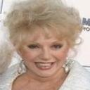 | 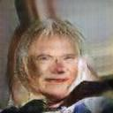 |  | 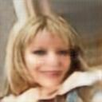 | 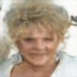 |

### Problem 2

For problem 2 the main idea is to jointly train to cycles together, what I think is to use the B' which generated by the first cycle as the shared one to train the second cycle so that the second cycle can adapt some "error" or so called "noise" from the first cycle to generate C'. Thus it is possible to transform from domain A to domain C. However, time is limited and training takes time, I don't have enough time to implement the jointly training of the Bi-CycleGAN, but it's still an interesting idea.

