# Homework4 report

### What scenario do I apply in?

>Domain A: women pictures   
>Domain B: body part segmenation  
>Domain C: child pictures    

### What do I modify? 

I simply train two seperate CycleGAN.

### Qualitative results
| Model name | Real A | Fake B | Real B | Fake A |
| :--------: | :----: | :----: | :----: | :----: |
| A<->B | 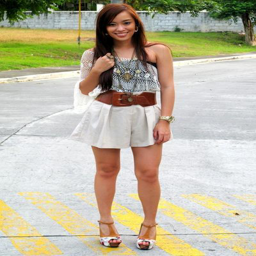 | 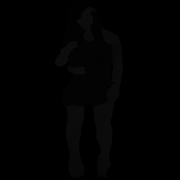 |  | 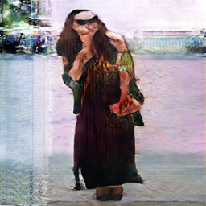 |
| A<->B | 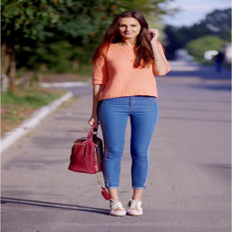 |  |  |  |
| C<->B | 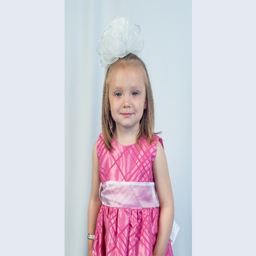 | 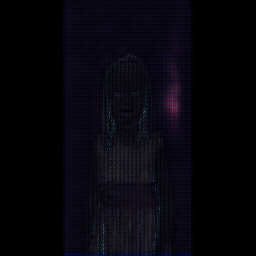 |  | 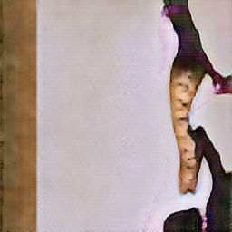 |
| C<->B | 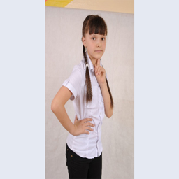 |  | 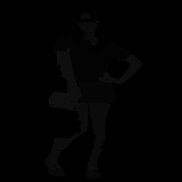 | 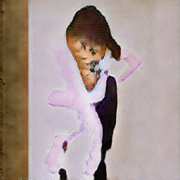 |

| Model name | Real C | Fake B | Fake A |
| :--------: | :----: | :----: | :----: |
| A<->B<->C | 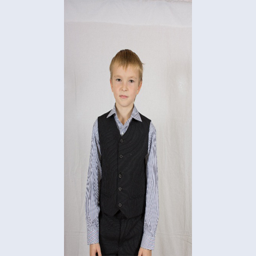 |  | 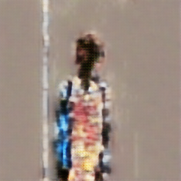 |

### My thoughts 

In the women <-> segmentation transformation, the body segmentation is roughly transformed to the corresponding body (skin, clothes, face). But the image background is noisy and meaningless. I think this is because the images contain only body part segmentaion while no background segmentaion, so learning a structured background is hard for the model. In the child <-> segmentation transformation, the transformation is poor and I think the training epoch is not enough. 

### Others

### Reference
https://github.com/junyanz/pytorch-CycleGAN-and-pix2pix
