# Homework4 report

### What scenario do I apply in?

### Qualitative results
| Domain | Real A | Fake B | Real B | Fake A |
| :----: | :----: | :----: | :----: | :----: |
| A ←→ B | 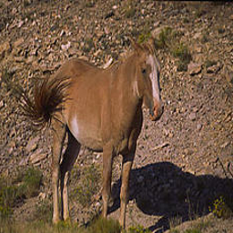 | 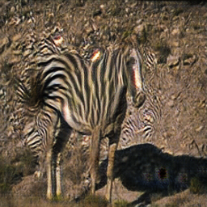 | 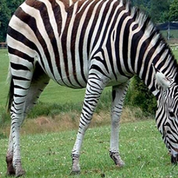 | 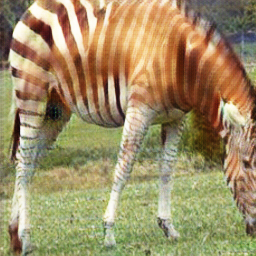 |
| A ←→ B | 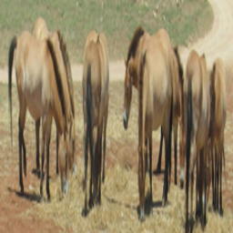 | 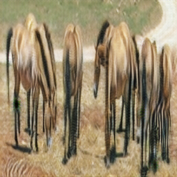 | 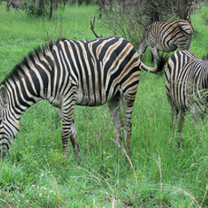 | 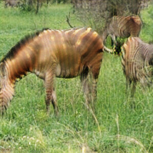 |
| A ←→ B | 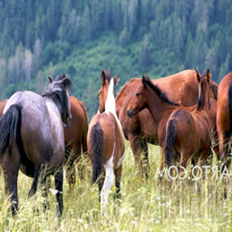 | 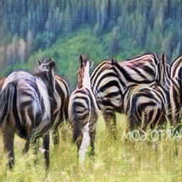 |  | 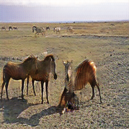 |
| A ←→ B | 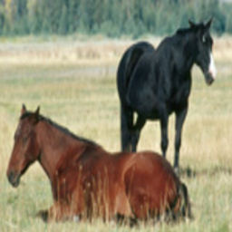 | 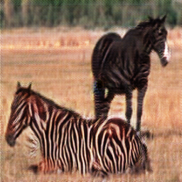 | 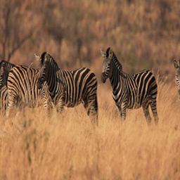 | 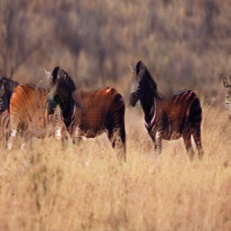 |
| A ←→ B | 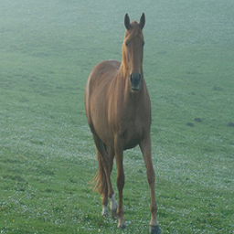 | 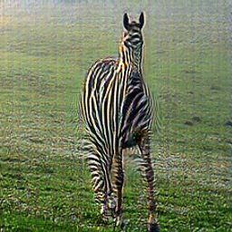 | 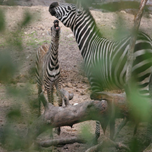 | 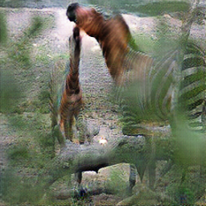 |
| A ←→ B | 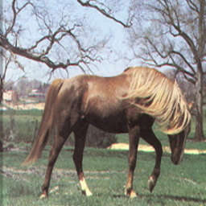 | 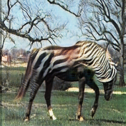 | 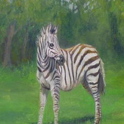 |  |
| A ←→ B | 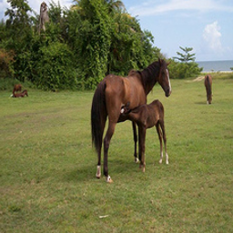 | 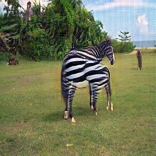 | 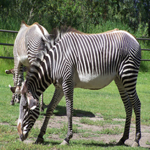 | 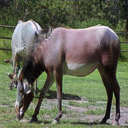 |
| B ←→ C | 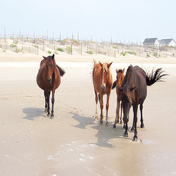 | 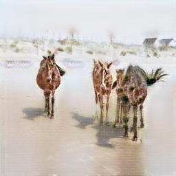 |  | 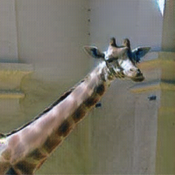 |
| B ←→ C |  | 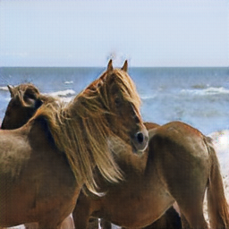 | 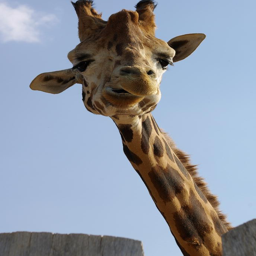 | 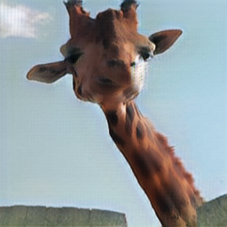 |
| B ←→ C | 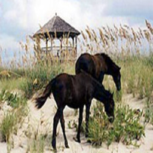 | 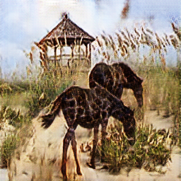 |  | 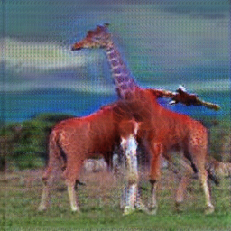 |
| B ←→ C | 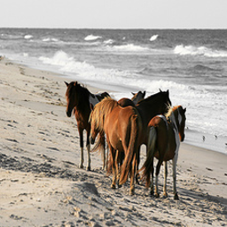 | 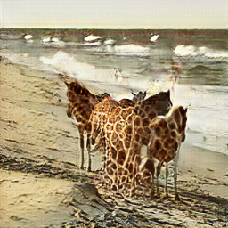 | 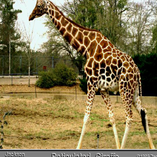 | 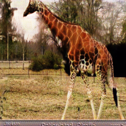 |
| B ←→ C | 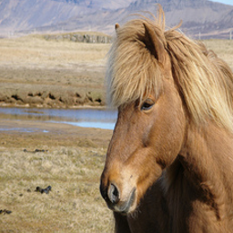 | 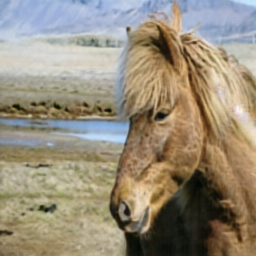 | 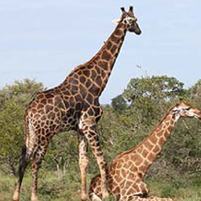 | 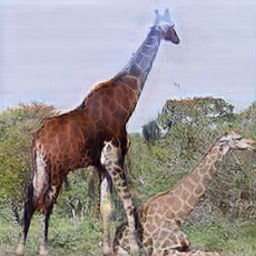 |
| B ←→ C | 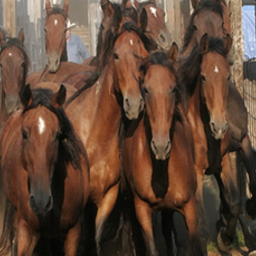 | 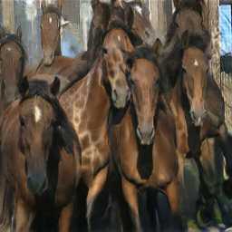 | 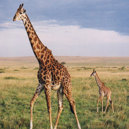 | 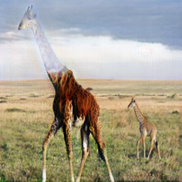 |
| B ←→ C | 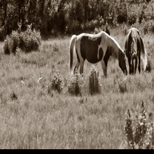 | 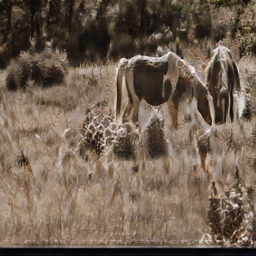 | 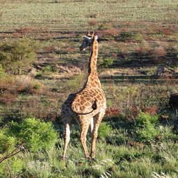 |  |
| B ←→ C |  |  |  |  |

### My thoughts 

### Others

### Reference
https://github.com/junyanz/pytorch-CycleGAN-and-pix2pix
