# Homework4 report

### What scenario do I apply in?
Inspired by the task of horse to zebra transformation, we defined our task as black bear to brown bear to panda. In fact, CycleGAN only works well in local color and texture pattern transfer, but are not able to achieve the semantic transfer such as dog to cat. We collected the training set of black bear, brown bear, and panda from ImageNet synset and clean up the data in which the main object in quite invisible.

### What do I modify? 

First, we'll need to modify the dataloader to load the images from three domains.
```
.
.
.

self.A_paths = make_dataset(self.dir_A)
self.B_paths = make_dataset(self.dir_B)
self.C_paths = make_dataset(self.dir_C)

.
.
.

A_img = Image.open(A_path).convert('RGB')
B_img = Image.open(B_path).convert('RGB')
C_img = Image.open(C_path).convert('RGB')

A = self.transform(A_img)
B = self.transform(B_img)
C = self.transform(C_img)

if self.opt.which_direction == 'AtoBtoC':
    input_nc = self.opt.input_nc
    intermediate_nc = self.opt.intermediate_nc
    output_nc = self.opt.output_nc
elif self.opt.which_direction == 'BtoCtoA':
    input_nc = self.opt.intermediate_nc
    intermediate_nc = self.opt.output_nc
    output_nc = self.opt.input_nc
elif self.opt.which_direction == 'CtoAtoB':
    input_nc = self.opt.output_nc
    intermediate_nc = self.opt.input_nc
    output_nc = self.opt.intermediate_nc

.
.
.

return {'A': A, 'B': B, 'C': C, 'A_paths': A_path, 'B_paths': B_path, 'C_paths': C_path}
```

Then, we also need to implement the discriminator loss for Bi-Cycle GAN.

```
def backward_D_basic(self, netD, real, fake):
        # Real
        pred_real = netD(real)
        loss_D_real = self.criterionGAN(pred_real, True)
        # Fake
        pred_fake = netD(fake.detach())
        loss_D_fake = self.criterionGAN(pred_fake, False)
        # Combined loss
        loss_D = (loss_D_real + loss_D_fake) * 0.5
        # backward
        loss_D.backward()
        return loss_D

def backward_D_A(self):
    fake_B = self.fake_B_pool.query(self.fake_B)
    loss_D_A = self.backward_D_basic(self.netD_A, self.real_B, fake_B)
    self.loss_D_A = loss_D_A.data[0]

def backward_D_B(self):
    fake_C = self.fake_C_pool.query(self.fake_C)
    loss_D_B = self.backward_D_basic(self.netD_B, self.real_C, fake_C)
    self.loss_D_B = loss_D_B.data[0]

def backward_D_C(self):
    fake_A = self.fake_A_pool.query(self.fake_A)
    loss_D_C = self.backward_D_basic(self.netD_C, self.real_A, fake_A)
    self.loss_D_C = loss_D_C.data[0]
```

And also the generator.

```
def backward_G(self):
    lambda_idt = self.opt.identity
    lambda_A = self.opt.lambda_A
    lambda_B = self.opt.lambda_B
    lambda_C = self.opt.lambda_C
    # Identity loss
    if lambda_idt > 0:
        # G_A should be identity if real_B is fed
        idt_A = self.netG_A(self.real_B) # this should look like B
        loss_idt_A = self.criterionIdt(idt_A, self.real_B) * lambda_B * lambda_idt
        # G_B should be identity if real_C is fed
        idt_B = self.netG_B(self.real_C) # this should look like C
        loss_idt_B = self.criterionIdt(idt_B, self.real_C) * lambda_C * lambda_idt
        # G_C should be identity if real_A is fed
        idt_C = self.netG_C(self.real_A) # this should look like A
        loss_idt_C = self.criterionIdt(idt_C, self.real_A) * lambda_A * lambda_idt

        self.idt_A = idt_A.data
        self.idt_B = idt_B.data
        self.idt_C = idt_C.data
        self.loss_idt_A = loss_idt_A.data[0]
        self.loss_idt_B = loss_idt_B.data[0]
        self.loss_idt_C = loss_idt_C.data[0]
    else:
        loss_idt_A = 0
        loss_idt_B = 0
        loss_idt_C = 0
        self.loss_idt_A = 0
        self.loss_idt_B = 0
        self.loss_idt_C = 0

    # GAN loss D_A(G_A(A))
    fake_B = self.netG_A(self.real_A)
    pred_fake = self.netD_A(fake_B)
    loss_G_A = self.criterionGAN(pred_fake, True)

    # GAN loss D_B(G_B(B))
    fake_C = self.netG_B(self.real_B)
    pred_fake = self.netD_B(fake_C)
    loss_G_B = self.criterionGAN(pred_fake, True)

    # GAN loss D_C(G_C(C))
    fake_A = self.netG_C(self.real_C)
    pred_fake = self.netD_C(fake_A)
    loss_G_C = self.criterionGAN(pred_fake, True)

    # A-->B cycle loss
    rec_A = self.netG_C(self.netG_B(fake_B))
    loss_cycle_A = self.criterionCycle(rec_A, self.real_A) * lambda_A

    # B-->C cycle loss
    rec_B = self.netG_A(self.netG_C(fake_C))
    loss_cycle_B = self.criterionCycle(rec_B, self.real_B) * lambda_B

    # C-->A cycle loss
    rec_C = self.netG_B(self.netG_A(fake_A))
    loss_cycle_C = self.criterionCycle(rec_C, self.real_C) * lambda_C

    # combined loss
    loss_G = loss_G_A + loss_G_B + loss_G_C + loss_cycle_A + loss_cycle_ + loss_cycle_C + loss_idt_A + loss_idt_B + loss_idt_C
    loss_G.backward()
```

### Qualitative results

Some results of two independent CycleGANs

| Real Black Bear | Fake Brown Bear | Reconstructed Black Bear | Real Brown Bear | Fake Black Bear | Reconstructed Brown Bear |
| :-----: | :-----: | :-----: | :-----: | :-----: | :-----: |
| 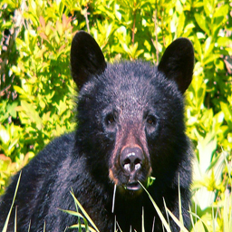 | 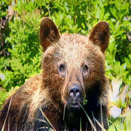 |  | 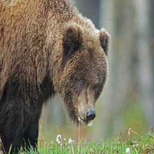 | 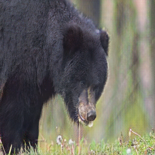 | 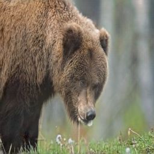 |
| 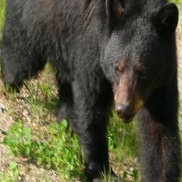 | 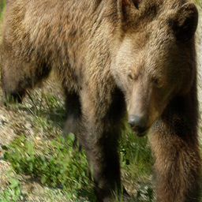 | 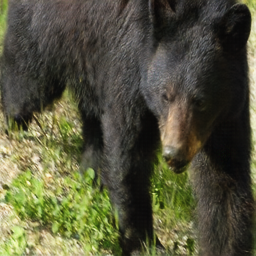 |  | 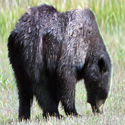 | 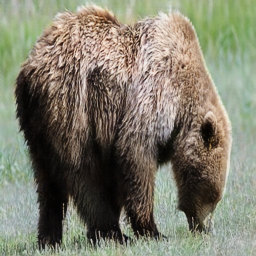 |
| 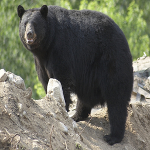 | 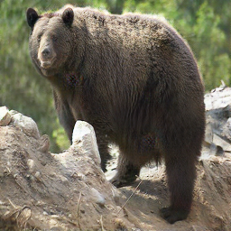 | 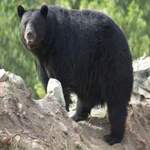 | 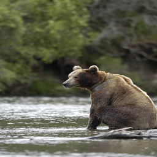 | 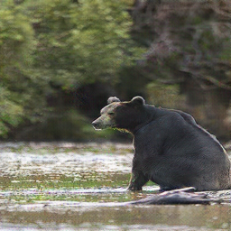 | 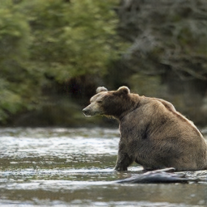 |

| Real Brown Bear | Fake Panda | Reconstructed Brown Bear | Real Panda | Fake Brown Bear | Reconstructed Panda |
| :-----: | :-----: | :-----: | :-----: | :-----: | :-----: |
| 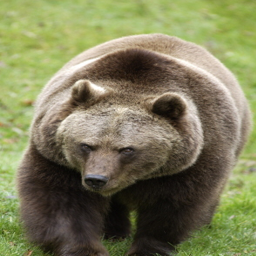 | 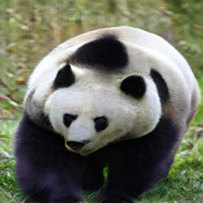 | 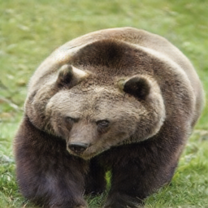 | 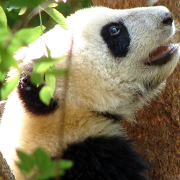 | 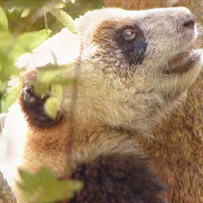 | 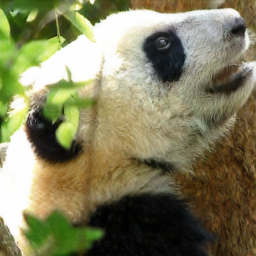 |
| 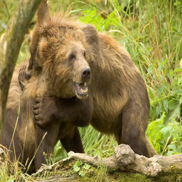 | 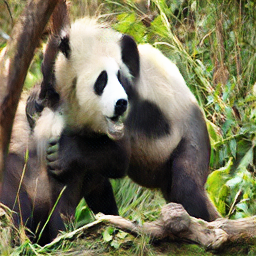 | 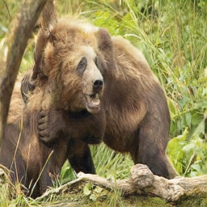 | 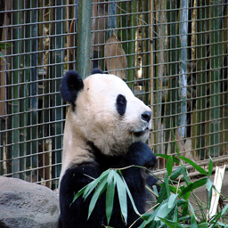 | 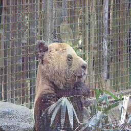 | 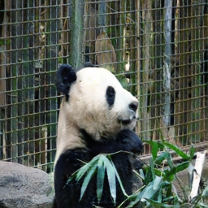 |
| 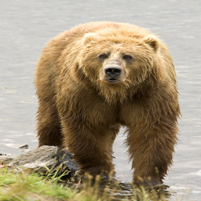 | 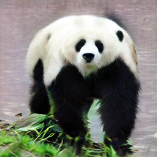 |  |  | 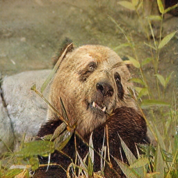 | 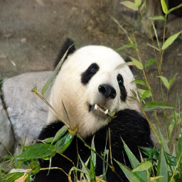 |

| Real Black Bear | Fake Brown Bear | Fake Panda |
| :-----: | :-----: | :-----: |
| 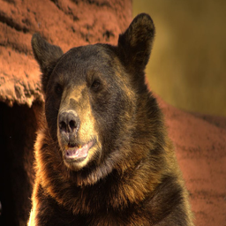 | 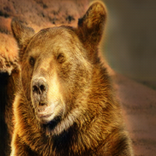 | 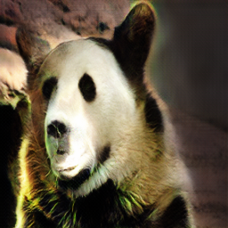 |

Some results of Bi-CycleGans

| Real Black Bear | Fake Brown Bear | Fake Panda |
| :-----: | :-----: | :-----: |
| 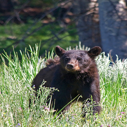 | 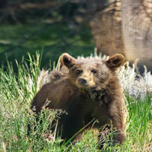 | 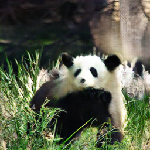 |
|  | 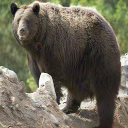 | 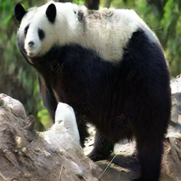 |
| 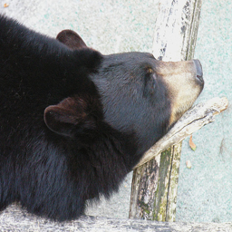 | 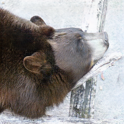 | 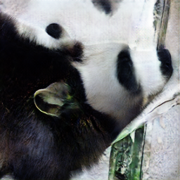 |

### My thoughts 
Just like what mentioned above, either CycleGAN Bi-CycleGAN works really well on local color and texture pattern transfer. However, for the panda domain, the black-and-white color pattern is quite sparse (unlike the zebra), and thus the transformation would be difficult for the model to learn. Moreover, the black-and-white pattern does contain some semantic information, for example, the black area around the eyes and the limbs, so the model is expected to learn to localize the eyes and limbs instead of replacing the color brown with white or black. Thus, in our results, the transfer from brown bear to panda looks less ideal while the transfer from black bear to brown bear looks satisfying.

### Others
Black2Brown loss over time
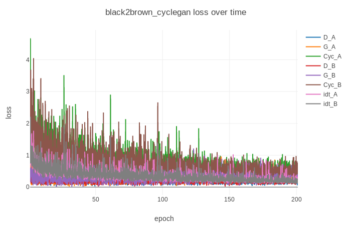

Brown2Panda loss over time
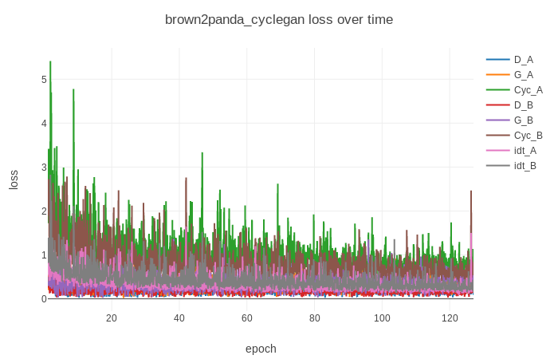

### Reference
**pytorch-CycleGAN-and-pix2pix** [[link](https://github.com/junyanz/pytorch-CycleGAN-and-pix2pix)]

**Unpaired Image-to-Image Translation using Cycle-Consistent Adversarial Networks** [[pdf](https://arxiv.org/pdf/1703.10593.pdf)]

**Toward Multimodal Image-to-Image Translation** [[pdf](https://arxiv.org/pdf/1711.11586.pdf)]

### Note
The training images was removed from the uploaded contents to avoid the file size becomes **horribly** large. The training images can easily obtain from ImageNet "black bear", "brown bear", and "panda" synsets.
