# Homework4 report

### What scenario do I apply in?

Domain A: Winter landscape Dataset
Domain B: Summer landscape Dataset
Domain C: Flowers Dataset

I trained A<-->B and B<-->C

### What do I modify? 

### Qualitative results
| Model name | Real A | Real B | Fake B | Fake A |
| :--------: | :----: | :----: | :----: | :----: |
|   A <-> B  |  | 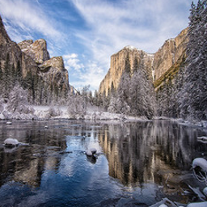 | 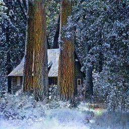 | 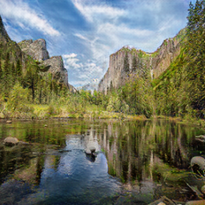 |
|   A <-> B  | 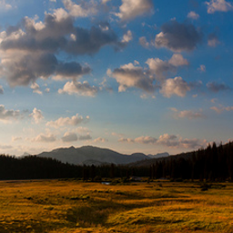 | 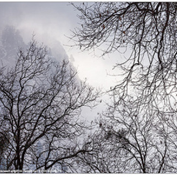 |  |  |
|   A <-> B  | 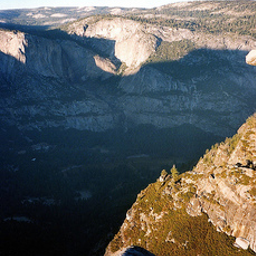 |  | 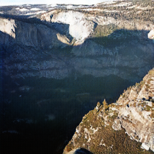 | 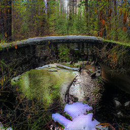 |
|   A <-> B  | 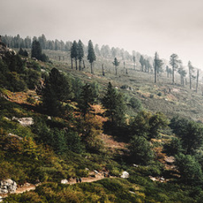 |  | 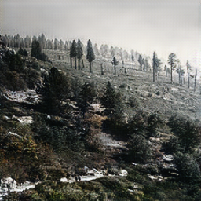 |  |
|   B <-> C  | 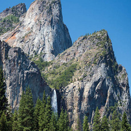 |  |  | 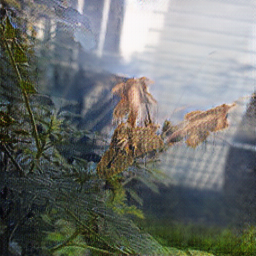 |
|   B <-> C  | 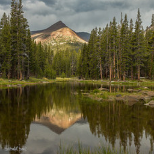 | 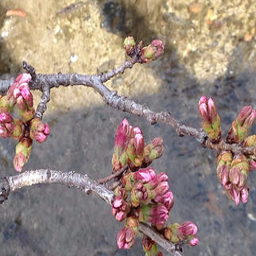 |  | 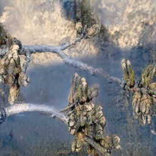 |
|   B <-> C  |  |  |  | 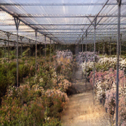 |

### My thoughts 
1. The transformation between winter and summer work quite good. When doing A->B, we can see that snow in the mountain melted and grass grows. When it's B->A, we can see some snow landscape appears.

2. The distance between domain B and C are pretty large, so the network can't learn too well.
It sometimes tried to turn whole landscape into multiple flowers instead of plant some flowers in the landscape.
But when it comes to C->B, it still works well to eliminate flowers in Domain C.

### Reference
junyanz's Pytorch implementation: [here](https://github.com/junyanz/pytorch-CycleGAN-and-pix2pix)
junyanz's [project page](https://junyanz.github.io/CycleGAN/)

