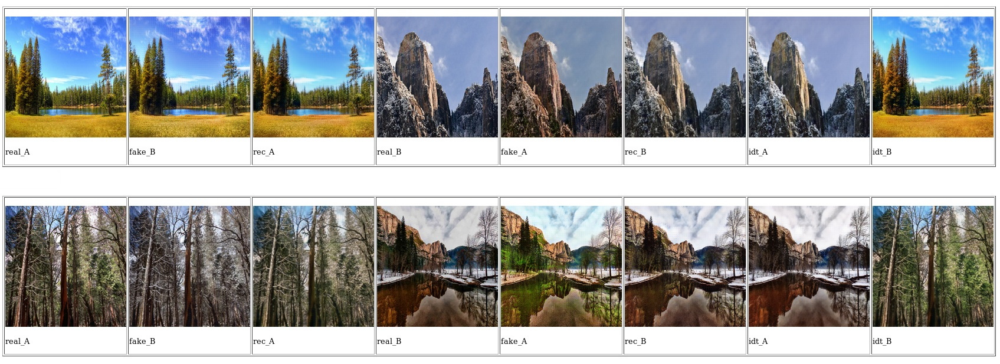
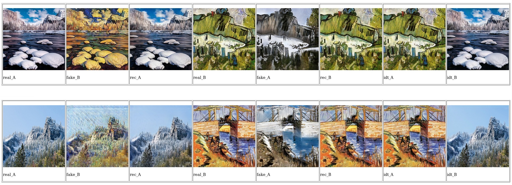
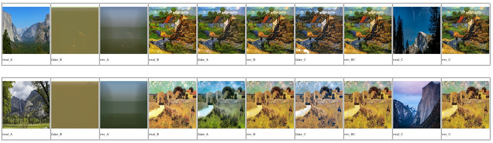

# Homework4 report
## 何品萱 (106062553)

### What scenario do I apply in?

利用CycleGAN處理unpaired image-to-image translation的問題。原本CycleGAN的方法目標是轉換 `A` `B` 兩個domain的image，目標是先學習 `G : A → B` ，使得 G(A) 生成出來的image的distribution與使用adversarial loss的distribution `B` 無法區分，接著利用反向mapping `F : B → A` 和cycle consistency loss讓 F(G(A)) 與原本 `A` 越相似。

本次作業目標實作BicycleGAN，達到cycles: `A -> B' -> A'` 和 `B -> C' -> B'`

`A`為summer Yosemite photos `B`為winter Yosemite photos `C`為Van Gogh paintings

Bi-CycleGAN達到同時轉換季節還可以轉換照片風格，增加照片風格多樣性，也可以運用在data augmentation。


### What do I modify? 

先分別train兩個CycleGANs，一個將夏季影像轉換成冬季，另一個將冬季影像轉換成Van Gogh圖畫風格。接著修改CycleGAN的loss function，將兩個Cycles `A <-> B` 和 `B <-> C` 一起訓練。

`cycle_gan_model.py`   loss function

```
        # GAN loss D_A(G_A(A))
        fake_B = self.netG_A(self.real_A)
        pred_fake = self.netD_A(fake_B)
        loss_G_A = self.criterionGAN(pred_fake, True)

        # GAN loss D_B(G_B(B))
        fake_A = self.netG_B(self.real_B)
        pred_fake = self.netD_B(fake_A)
        loss_G_B = self.criterionGAN(pred_fake, True)
        
        # GAN loss D_C(G_C(C))
        fake_B = self.netG_C(self.real_C)
        pred_fake = self.netD_C(fake_B)
        loss_G_C = self.criterionGAN(pred_fake, True)
        
        # GAN loss D_BC(G_C(B))
        fake_C = self.netG_BC(self.real_B)
        pred_fake = self.netD_C(fake_B)
        loss_G_BC = self.criterionGAN(pred_fake, True)
        #fake_C = fake_A

        # Forward cycle loss
        rec_A = self.netG_B(fake_B)
        loss_cycle_A = self.criterionCycle(rec_A, self.real_A) * lambda_A
        rec_BC = self.netG_C(fake_C)
        loss_cycle_BC = self.criterionCycle(rec_BC, self.real_B) * lambda_A

        # Backward cycle loss
        rec_B = self.netG_A(fake_A)
        loss_cycle_B = self.criterionCycle(rec_B, self.real_B) * lambda_B
        rec_C = self.netG_BC(fake_B)
        loss_cycle_C = self.criterionCycle(rec_C, self.real_C) * lambda_B
        
        # combined loss
        loss_G = loss_G_A + loss_G_B + loss_G_C + loss_G_BC + loss_cycle_A + loss_cycle_BC + loss_cycle_B + loss_cycle_C + loss_idt_A + loss_idt_B + loss_idt_BC + loss_idt_C
        loss_G.backward()
```

### Qualitative results
CycleGANs

summer to winter
<p></p>

winter to vangogh
<p></p>

Bi-CycleGAN
<p></p>

### My thoughts 

由於時間和資源限制，BicycleGAN的performance與預期有落差，loss function部分可能還要再增加或調整。

### Others

### Reference
J.-Y. Zhu, T. Park, P. Isola, and A. A. Efros. Unpaired image-to-image translation using cycle-consistent adversarial networks. In ICCV, 2017.

J.-Y. Zhu, R. Zhang, D. Pathak, T. Darrell, A. A. Efros, O. Wang, and E. Shechtman. Toward multimodal image-to-image translation. In Advances in Neural Information Processing Systems (NIPS), 2017.

