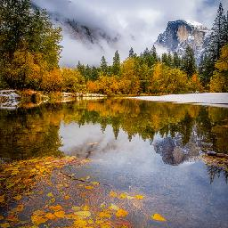
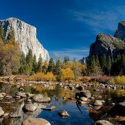
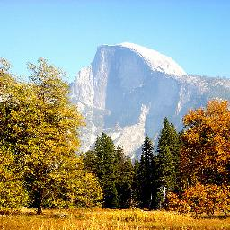
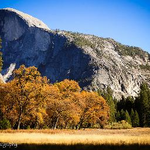

# Homework4 report (105061525 許菀庭)

## My Scenario
我選擇的三個domain是冬天、夏天和秋天的風景圖。
下面我秀一些example data:
<table>
  <tr>
    <td>Autumn</td>
    <td></td>
    <td></td>
    <td></td>
    <td></td>
    <td></td>
  </tr>
  <tr>
    <td>Summer</td>
    <td></td>
    <td></td>
    <td></td>
    <td></td>
    <td></td>
  </tr>
  <tr>
    <td>Winter</td>
    <td></td>
    <td></td>
    <td></td>
    <td></td>
    <td></td>
  </tr>
</table>

## Method 

### Data Collection
夏天和冬天的照片cycleGAN本身就有提供，但沒有秋天的，因此第一步我去蒐集了秋天的照片。
* 夏天和冬天的照片都是來自yosemite，因此我從flickr上搜尋autumn yosemite，爬下了兩千多張yosemite秋天的照片。
* 接著我做了一些preprocess，每張照片resize讓短邊為256 pixels，然後crop正中間，讓照片變成256x256。
* 最後從這兩千多張照片隨機取500張做為test set，剩下的1591張為train set。

### Train Two CycleGAN
我用[cycleGAN prtorch的code](https://github.com/junyanz/pytorch-CycleGAN-and-pix2pix) train了兩個cycleGAN model:
* cycle1: 夏天和秋天的轉換
* cycle2: 夏天和冬天的轉換

為了實現秋天到夏天再到冬天，我先把秋天的圖用cycle1的model轉成夏天，接著把這些轉成夏天的圖input到cycle2的model轉成冬天。

## Qualitative results

以下我秀了八組從秋天到夏天再到冬天的照片。
<table>
  <tr>
    <td width="100">Autumn</td>
    <td width="100">Summer</td>
    <td width="100">Winter</td>
  </tr>
  <tr>
    <td width="100"></td>
    <td width="100"></td>
    <td width="100"></td>
  </tr>
  <tr>
    <td></td>
    <td></td>
    <td></td>
  </tr>
  <tr>
    <td></td>
    <td></td>
    <td></td>
  </tr>
  <tr>
    <td></td>
    <td></td>
    <td></td>
  </tr>
  <tr>
    <td></td>
    <td></td>
    <td></td>
  </tr>
  <tr>
    <td></td>
    <td></td>
    <td></td>
  </tr>
  <tr>
    <td></td>
    <td></td>
    <td></td>
  </tr>
  <tr>
    <td></td>
    <td></td>
    <td></td>
  </tr>
</table>

## My thoughts 
從結果我觀察到下面兩點:
1. 秋天到夏天的model能夠將山或草地或樹葉變成橘黃色，而夏天到冬天的model可以將山或地面變成白色，有時也能將樹葉變不見。
2. 夏天和秋天的照片比較像，所以有時效果沒有很好，只會將整張照片變得偏黃而已；而夏天和冬天差異很大，效果也比較顯著。
3. 我認為這種不太需要變換形狀，主要是修改顏色和pattern的task用cycleGAN可以表現得比較好，因為若是形狀改變了，在reconstruct的時候會比較困難，就會比較難學好。

## Reference
* Zhu, Jun-Yan, et al. "Unpaired image-to-image translation using cycle-consistent adversarial networks." arXiv preprint arXiv:1703.10593 (2017).
* https://junyanz.github.io/CycleGAN/
