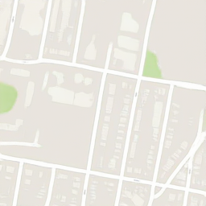
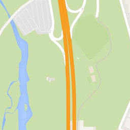
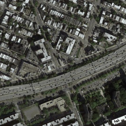
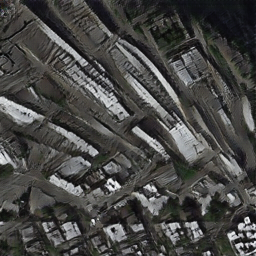
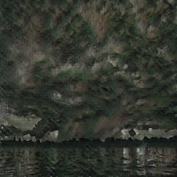
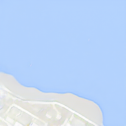
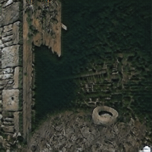

# Homework4 report
高穎 106062525

### What scenario do I apply in?

Cycle GAN 可以做到兩個domain之間的轉換,這次實作的Bi-Cycle GAN可以做到三個domain之間的轉換

A->B 將衛星地圖轉換成google地圖

A->C 將衛星地圖轉化成圖畫的風格

### What do I modify? 
you can show some snippet

在原本Cycle GAN的基礎上,加入第三個Domain的資訊.包含dataset的路徑,A到C的generator,以及C到A的generator,以及discriminator,lossfunction等等

        
        # GAN loss D_A(G_AC(A))
        fake_C = self.netG_AC(self.real_A)
        pred_fake = self.netD_AC(fake_C)
        loss_G_AC = self.criterionGAN(pred_fake, True)
        
        # Forward cycle loss
        rec_AC = self.netG_C(fake_C)
        loss_cycle_AC = self.criterionCycle(rec_AC, self.real_A) * lambda_AC
        
        loss_G = loss_G_A + loss_G_B + loss_cycle_A + loss_cycle_B + loss_idt_A + loss_idt_B + loss_G_AC + loss_G_C +          
                 loss_cycle_AC + loss_cycle_C + loss_idt_AC + loss_idt_C

### Qualitative results

Cycle GAN : A->B

| Domain | real A | fake B | real B |
| :----: | :-----:| :----: | :----: |
| A->B ||  |  |  |
| A->B ||  |  |  |

Cycle GAN : A->C

| Domain | real A | fake C | real C | fake A |
| :----: | :-----:| :----: | :----: | :----: | 
| A->C ||  |  |  |
| A->C ||  |  |  |

Bi-Cycle GAN : A->B and A->C

| Domain | real A | fake B | real B | fake A | real A | fake C | real C | fake A |
| :----: | :-----:| :----: | :----: | :----: | :----: | :----: | :----: | :----: |
| A->B and A->C ||  |  |  ||  |  |  |
| A->B and A->C ||  |  |  ||  |  |  |

### My thoughts 
you can make some comments on the your own homework, e.g. what's the strength? what's the limitation?

### Others

### Reference
