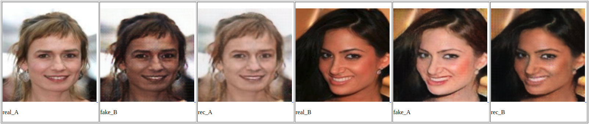
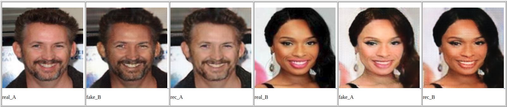
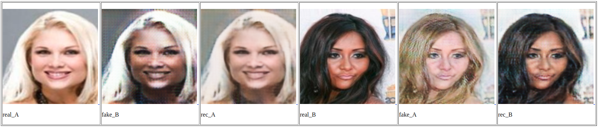
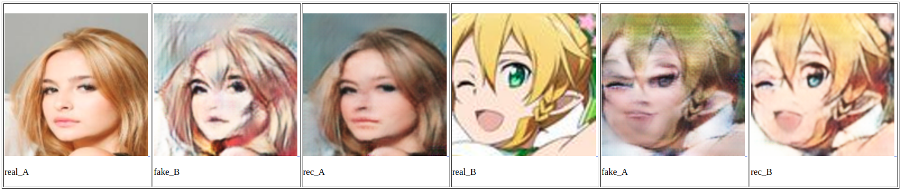
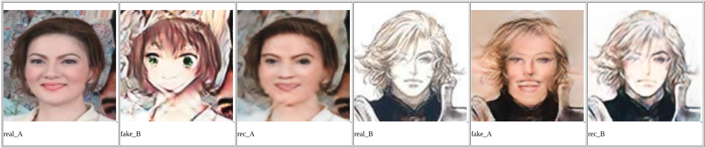

# Homework4 report

### What scenario do I apply in?

Domain-A is some people skin color with tanned or black . 
Domain-B is some people skin color with pale or white. 
Domain-C is some animate character image. 

At first I try to transfer three different race(e.g.Asian-American-Arabian) , and expected to see some facial features changed. 
But after I saw my A-to-B transfer , I thought it just change the color of hair and skin. 
So I decided to change my domain-C into animate.
### What do I modify? 

I collect domainA and domainB data from celebA about 400 images individually. 
And I collect domainC data from internet for 400 images same as domainA and domainB. 
I just trained two cycle GAN without Bi-cycle GAN. 
I change the input image size from '256' to '128',and the batch size used 2. 
The other parameter I used default. 

### Qualitative results
A<->B 
<td></td>
<td></td>
<td></td>

B<->C 
<td></td>
<td></td>
<td></td>

A disaster... 

### My thoughts 
I think cycle GAN can process two object with similar geometric structure but only change the color , attribute , style. 
Cycle GAN did well on style transfer , but when we'd like to see some structure change , it didn't process that well.   

### Others
I had read `Toward Multimodal Image-to-Image Translation(Bicycle GAN)` and found that it's more similar to pix2pix. 
It without the advantage of `cycle GAN`,it need pair data for training , but `Bicycle GAN` can generate diversity results by sampling different latent code from latent space(a space with probability distributions). 

### Reference
[1]https://github.com/junyanz/pytorch-CycleGAN-and-pix2pix 
[2]https://github.com/junyanz/BicycleGAN 
