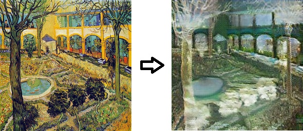
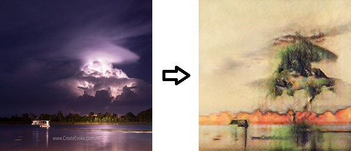
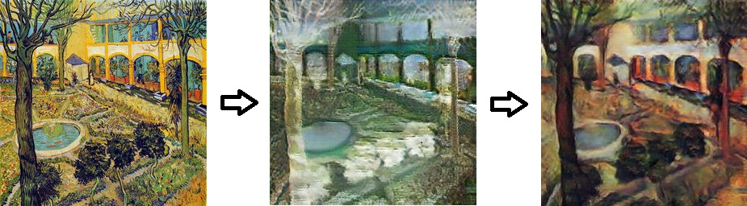

# Homework4 report

I just use code from https://github.com/xhujoy/CycleGAN-tensorflow and train vangogh2photo and photo2cezanne.
But I can't tune to perform good.
在paper上顯上可以達到圖左側的效果

but my output 都長得很普通，我的vangogh2photo

一直tune不到一個好的結果

### What scenario do I apply in?
我想要做的是vangogh的畫風轉到一般photo和一般photot畫風轉到cezanne，
所以我photo是mutual domain，
因為我認為我找到的dataset包含各種photo代表的是image裡的content，
所以我認為vangogh的畫風跟cezanne的畫風沒辦法直接做轉換必須經過mutual domain(content)，

### What do I modify? 
我只有改dataset，
其他code原本想要接成end2end的Bicycle GAN，
不過後來我想不出來Bicycle GAN 要A to B to C再從C轉回B* 然後保證B跟B* 的相同再把B* 轉回A* 並且保證A* 跟A的相似。
還是要A to B就從B轉回A* 然後再從B轉到C 再從C轉回B* ，
就是搞不懂這個BicycleGAN到底要用甚麼步驟維持那些相似度，
並且我也不認為單純把同樣的cycle GAN接兩能夠提升甚麼效果。

### Qualitative results
#### result from vangogh2photo

#### result from photo2cezanne

#### Bicycle GAN

### My thoughts 
我不覺得接兩個Cycle GAN能夠增加甚麼performance，
並且如果兩張圖有mutual domain，
那應該直接用一個Cycle GAN也可以transfer過去，
並且我認為我目前參數應該也還沒tune到一個比較正確的參數，
目前試了三種lr跟epoch跟batch數，
都還沒辦法產出很好看的output，
可能可以加入improved WGAN的方法來提升Training的可行性。

### Others

### Reference
