# Homework4 report

### What scenario do I apply in?
>X: horse  
>Y: zebre  
>Z: lion  

### What do I modify? 
#### Separate training
I simply train two seperate CycleGAN using this [Tensorflow implementation](https://github.com/vanhuyz/CycleGAN-TensorFlow) and download the images of lion from ImageNet dataset. 

#### Jointly training
I try to modified the code based on the CycleGAN above, and first thing is to define two cycle in the model. Then we define loss to improve the performance by adding bi-direction loss: `X<->Y & Y<->Z`, which shared Y domain.
```python

# X <-> Y
cycle_loss_xy = self.cycle_consistency_loss(self.G, self.F, x, y)

# X -> Y
fake_y = self.G(x)
G_gan_loss = self.generator_loss(self.D_Y, fake_y, use_lsgan=self.use_lsgan)
G_loss =  G_gan_loss + cycle_loss_xy
D_Y_loss = self.discriminator_loss(self.D_Y, y, self.fake_y, use_lsgan=self.use_lsgan)

# Y -> X
fake_x = self.F(y)
F_gan_loss = self.generator_loss(self.D_X, fake_x, use_lsgan=self.use_lsgan)
F_loss = F_gan_loss + cycle_loss_xy
D_X_loss = self.discriminator_loss(self.D_X, x, self.fake_x, use_lsgan=self.use_lsgan)

# Y <-> Z
cycle_loss_yz = self.cycle_consistency_loss(self.G2, self.F2, y, z)

# Y -> Z
fake_z = self.G2(y)
G_gan_loss_2 = self.generator_loss(self.D_Z, fake_z, use_lsgan=self.use_lsgan)
G_loss_2 =  G_gan_loss_2 + cycle_loss_yz
D_Z_loss = self.discriminator_loss(self.D_Z, z, self.fake_z, use_lsgan=self.use_lsgan)

# Z -> Y
fake_y = self.F2(z)
F_gan_loss_2 = self.generator_loss(self.D_Y, fake_y, use_lsgan=self.use_lsgan)
F_loss_2 = F_gan_loss_2 + cycle_loss_yz
D_Y_loss_2 = self.discriminator_loss(self.D_Y, y, self.fake_y, use_lsgan=self.use_lsgan)

```
### Qualitative results
#### horse <-> zebra
<table border=1>
<tr>
<td colspan="2">
horse → zebra
</td>
<td colspan="2">
zebra → horse
</td>
</tr>

<tr>
<td>
real horse
</td>
<td>
fake zebra
</td>
<td>
real zebra
</td>
<td>
fake horse
</td>
</tr>

<tr>
<td>

</td>
<td>

</td>
<td>

</td>
<td>
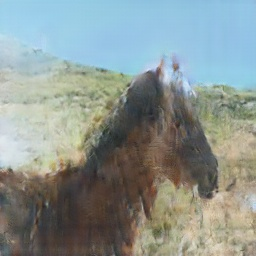
</td>
</tr>

<tr>
<td>

</td>
<td>
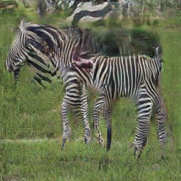
</td>
<td>

</td>
<td>
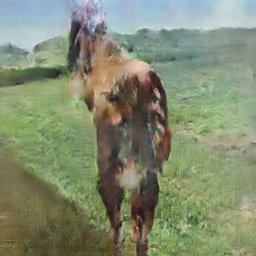
</td>
</tr>

<tr>
<td>

</td>
<td>
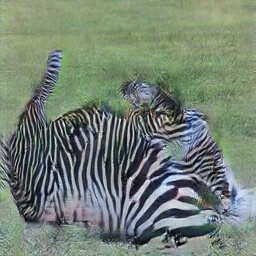
</td>
<td>

</td>
<td>

</td>
</tr>
</table>

#### zebra <-> lion
<table border=1>
<tr>
<td colspan="2">
zebra → lion
</td>
<td colspan="2">
lion → zebra
</td>
</tr>

<tr>
<td>
real zebra
</td>
<td>
fake lion
</td>
<td>
real zebra
</td>
<td>
fake horse
</td>
</tr>

<tr>
<td>

</td>
<td>
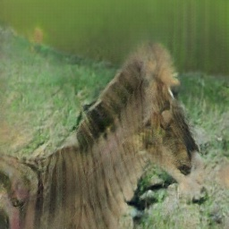
</td>
<td>
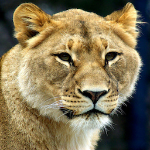
</td>
<td>
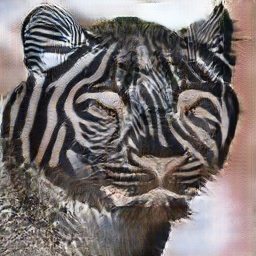
</td>
</tr>

<tr>
<td>

</td>
<td>
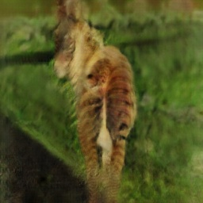
</td>
<td>
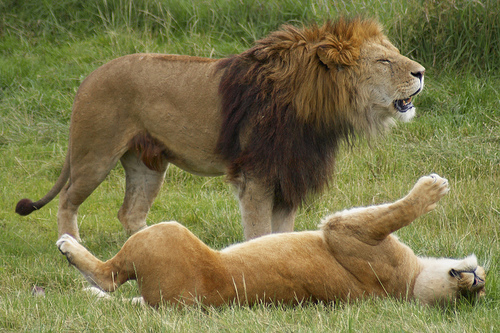
</td>
<td>
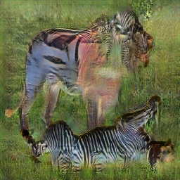
</td>
</tr>

<tr>
<td>

</td>
<td>
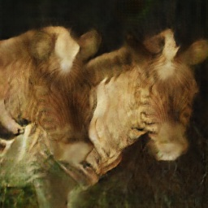
</td>
<td>
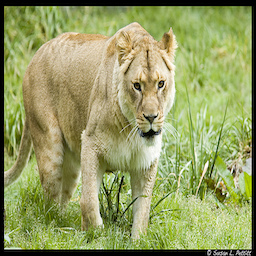
</td>
<td>
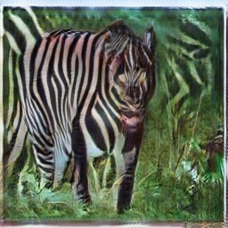
</td>
</tr>
</table>

#### horse -> zebra -> lion
<table border=1>
<tr>
<td>

</td>
<td>
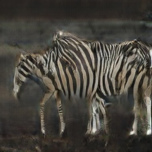
</td>
<td>
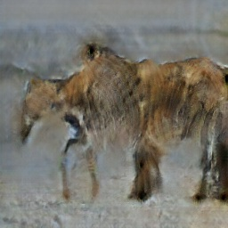
</td>
</tr>
 <tr>
<td>

</td>
<td>

</td>
<td>
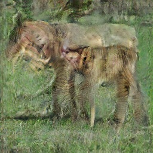
</td>
</tr>
 <tr>
<td>

</td>
<td>

</td>
<td>
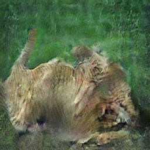
</td>
</tr>
</table>


### My thoughts 
In this homework, I am confused at the BicycleGAN TA and teacher want and the other one BicycleGAN that introduced in NIPs 2017. I think these two are totally different since one is based on CycleGAN and the other one is based on conditional GANs. What we are doing in this homework is much more similar to [starGAN](https://github.com/yunjey/StarGAN) from my perspective.

### Reference
[starGAN - Github](https://github.com/yunjey/StarGAN)  
[CycleGAN - Github](https://github.com/vanhuyz/CycleGAN-TensorFlow)
