# Homework4 report  - 106062510
### What scenario do I apply in?
I decided to translate "Cezanne" style to "Photo" style and then translate "Photo" style to "Vangogh" style.

The Cycle-GAN project is cloned from this git repository : https://github.com/xhujoy/CycleGAN-tensorflow, which is an implementation of cycle-gan using tensorflow.

I downloaded the datasets from https://people.eecs.berkeley.edu/~taesung_park/CycleGAN/datasets/ to get original style transfer datasets <b>cezanne2photo</b> and <b>vangogh2photo</b>. 
### What do I modify? 
Since cycle-gan trains two style transfer directions at the same time, it's fine to use the original dataset, but I still transfer the "vangoh2photo" dataset into "photo2vangogh" dataset. So the "photo" part images in cezanne2photo and photo2vangogh are the same.

I trained the two cycle-gans separately but they had the same "photo" data. At inference/test time, I first transfer Cezanne images into photo, named "gen_photo", and then transfer the gen_photo images into vangogh. Water I'll show the results.

I only modified some part of datasets and set some hyperparameters.
### Qualitative results
Here shows some testing results. I trained "cezanne2photo" model for 400 epochs and "photo2vangogh" model for 200 epochs.

#### Cezanne to Photo
The result from cezanne to photo is somehow not very satisfying. After training for 400 epochs, the result still not very close to real images. I think maybe human is more strict than the discriminator(however, maybe we should train more epochs for stronger discriminator to encourage better results from generator), so we think this is not very real even if the discriminator think it is.

Original | Generated Result
----------|----------
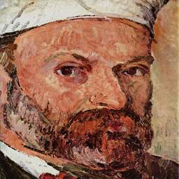 | 
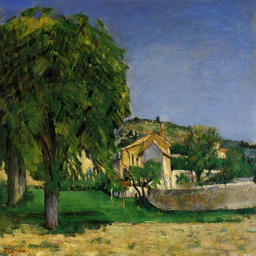 | 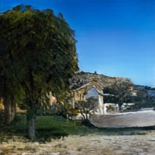
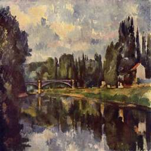 | 
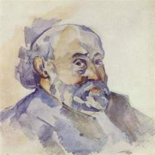 | 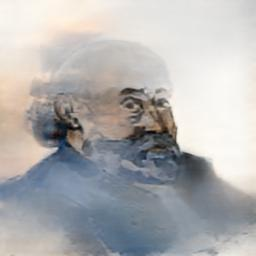
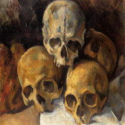 | 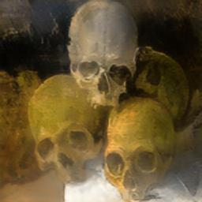
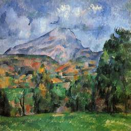 | 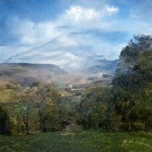
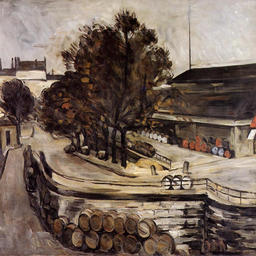 | 
#### Photo(original test data) to Vangogh
The result from real photo to vangogh style seems very well.

Original | Generated Result
----------|----------
 | 
 | 
 | 
 | 
 | 
 | 
 | 
 | 
 | 

#### Generated(from cezanne2photo) Photo to Vangogh
Original Cezanne | Generated Photo Result | Generated Vangogh Result
----------|----------|------------
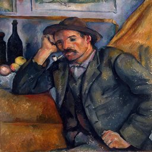 | 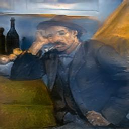 | 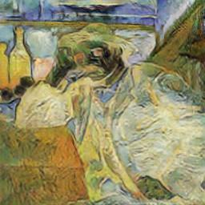
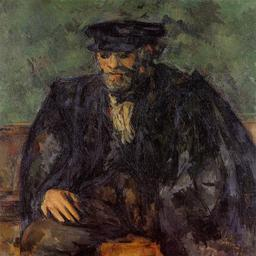 | 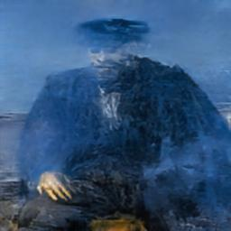 | 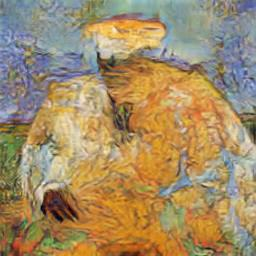
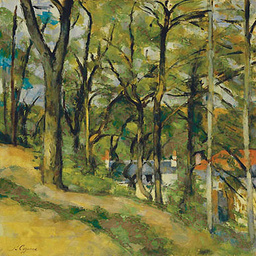 |  | 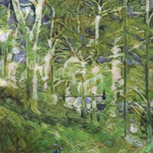
 | 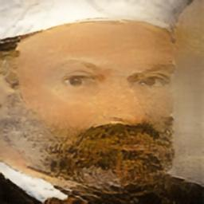 | 
 |  | 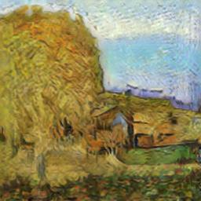
 |  | 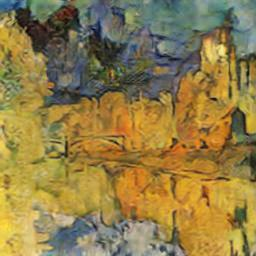
 |  | 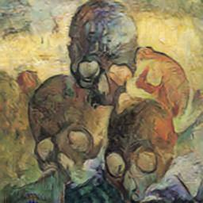
 |  | 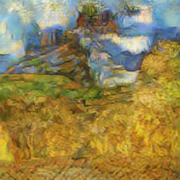
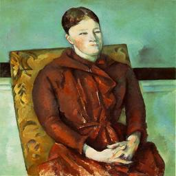 | 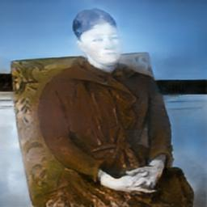 | 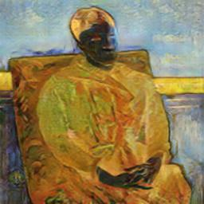
 | 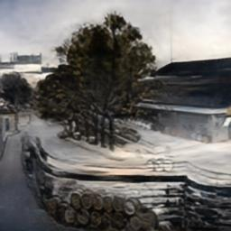 | 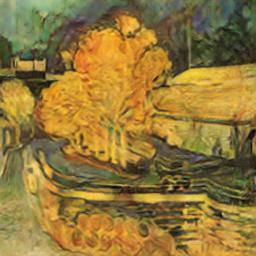
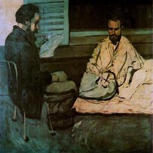 |  | 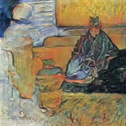
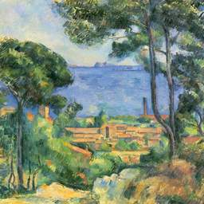 |  | 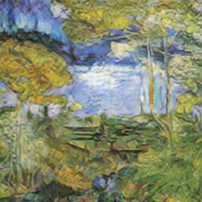
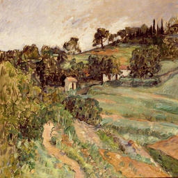 |  | 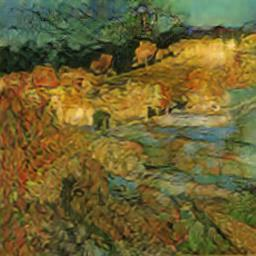
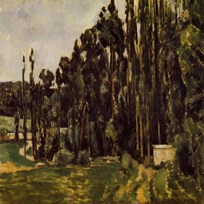 | 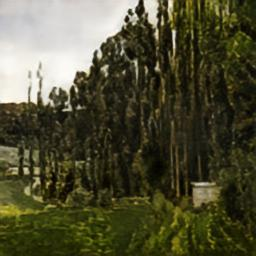 | 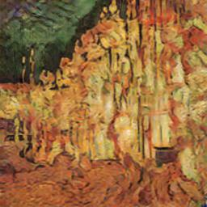
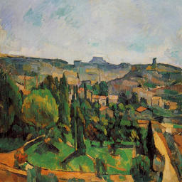 | 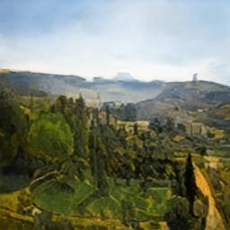 | 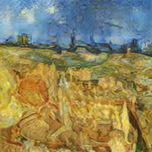
### My thoughts
According to my observation of the downloaded dataset, most of the photo images are scenes rather than real people(human/ human faces) such that the model was hard to catch the human feature and mistook human faces as natural scenes.

More over, the number of painters' images(cezanne style and vangogh style) are less than photo images, so the dataset of A and B are unbalanced, this may cause generator generate images with less variety when transfer from photo to paintings(actually many scene photos came out similar style results(similar textures, colors....)).

Maybe increasing the weight of cycle-consistency would improve the result. Or maybe we can feed the X(Y) and X'(Y') into CNN to capture the content features and style features (inspired from [this paper](https://arxiv.org/abs/1508.06576)) and give a weighted sum of content loss and style loss rather than compare the whole images directly as cycle-consistency loss.
### Others
#### Training settings
    -epoch: 200
    -batch: 1
    -image size: 256
    -generator filters in first conv layer: 64
    -number of discriminator filters in first conv layer: 64
    -initial learning rate for adam: 0.0002
    -momentum term of adam: 0.5
    -generation network using reidule block: True
    -running environment: NVIDIA 1080 Ti 
#### Some files
    -'./CycleGAN-tensorflow/' is the whole project of cycle-gan, containing the model and the results
    -'./CycleGAN-tensorflow/datasets/' contains 'cezanne2photo' for training cezanne(A) to photo(B) and 'photo2vangogh' for training photo(A) to vangogh(B) and 'gen_photo2vangogh' which stores the results of photo generated from cezanne and was used for the generation from gen_photo to vangogh
    -'./CycleGAN-tensorflow/cezanne2photot_test' is the result from cezanne2photo model
    -'./CycleGAN-tensorflow/photot2vangogh_test' is the result from original photo2vangogh model
    -'./CycleGAN-tensorflow/gen_photo2vangogh_test' is the result from generated photo2vangogh model
    -'./checkpoint/' stores all the models
    ### Reference
[Cycle-Gan-Project in tensorflow](https://github.com/xhujoy/CycleGAN-tensorflow)
