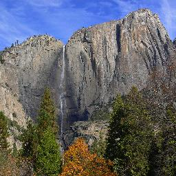
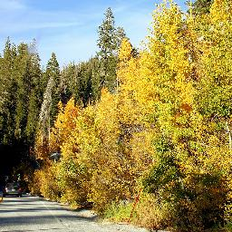
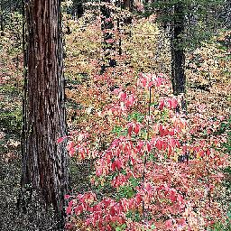

# Homework4 report

### What scenario do I apply in?
在 Cycle GAN 的 paper，已經有 yosemite，夏天到冬天的轉換，我想根據這個work再增加轉換到秋天的功能。

Yosemite Autumn -> Summer -> Winter

<table>
  <tr>
    <td>Autumn</td>
    <td></td>
    <td></td>
    <td></td>
    <td></td>
  </tr>
  <tr>
    <td>Summer</td>
    <td></td>
    <td></td>
    <td></td>
    <td></td>
  </tr>
  <tr>
    <td>Winter</td>
    <td></td>
    <td></td>
    <td></td>
    <td></td>
  </tr>
</table>
### What do I modify? 

#### Data Collection

- 爬Google image和Flickr的圖片，參考image crawler https://github.com/hellock/icrawler
- 手動挑掉黑白或是不相關的圖片

#### Data Preprocess

- 把爬到的資料轉成256\*256，先把短邊resize到256，再center crop得到256\*256的圖

### Qualitative results
put some interesting images generated from your Bi-CycleGANs

#### Yosemite Autumn -> Summer -> Winter

<table>
  <tr>
    <td></td>
    <td></td>
    <td></td>
  </tr>
  <tr>
    <td></td>
    <td></td>
    <td></td>
  </tr>
  <tr>
    <td></td>
    <td></td>
    <td></td>
  </tr>
  <tr>
    <td></td>
    <td></td>
    <td></td>
  </tr>
  <tr>
    <td></td>
    <td></td>
    <td></td>
  </tr>
  
  <tr>
    <td></td>
    <td></td>
    <td></td>
  </tr>
  <tr>
    <td></td>
    <td></td>
    <td></td>
  </tr>
  <tr>
    <td></td>
    <td></td>
    <td></td>
  </tr>
  
</table>

### My thoughts 
you can make some comments on the your own homework, e.g. what's the strength? what's the limitation?

### Others

### Reference
