# Homework4 105061516 Report

### What scenario do I apply in?
A: cow  
B: buffalo    
C: rhinoceros   
Why: 預想是讓其他牛加上乳牛花紋、氂牛的毛、或者犀牛的角，進而可能在隨機輸入圖片產生效果。

### What do I modify? 
1. Train on subsets of Animals with Attributes 2
2. Add some Bi-CycleGAN implement  
  + Code/Cmodels/bicycle_gan_model.py     
  + Code/data/biunaligned_dataset.py

### Qualitative results
> put some interesting images generated from your Bi-CycleGANs
<table border=2 align=center  width="100%">
  做得不錯的CASE
<tr>
  <td>
    real_A
  </td>
  <td>
    bi AtoB
  </td>
  <td>
    AtoB
  </td>
  <td>
    bi AtoC
  </td>
  <td>
    AtoC
  </td>
</tr>
<tr>
  <td>
    
  </td>
  <td>
    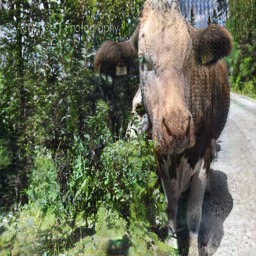
  </td>
  <td>
    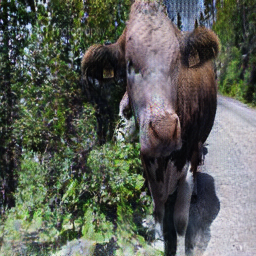
  </td>
  <td>
    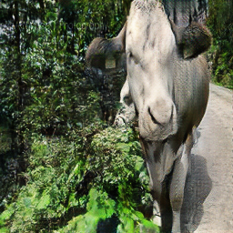
  </td>
  <td>
    
  </td>
</tr>
<tr>
  <td>
    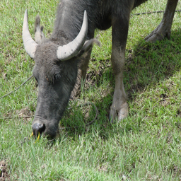
  </td>
  <td>
    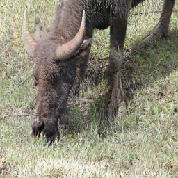
  </td>
  <td>
    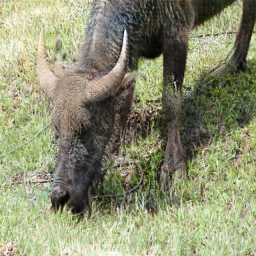
  </td>
  <td>
    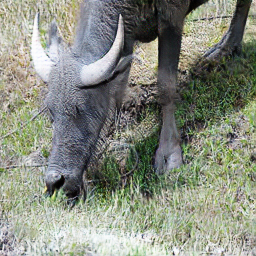
  </td>
  <td>
    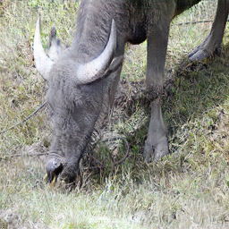
  </td>
</tr>
<tr>
  <td>
    real_B
  </td>
  <td>
    bi BtoA
  </td>
  <td>
    BtoA
  </td>
  <td>
    bi BtoAtoC
  </td>
</tr>
<tr>
  <td>
    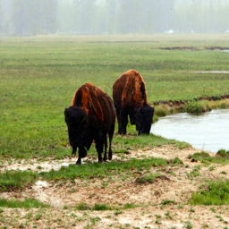
  </td>
  <td>
    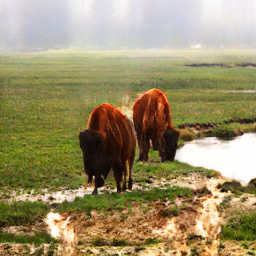
  </td>
  <td>
    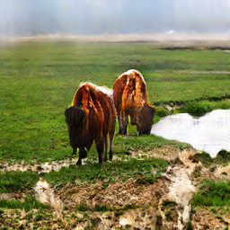
  </td>
  <td>
    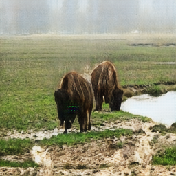
  </td>
</tr>
<tr>
  <td>
    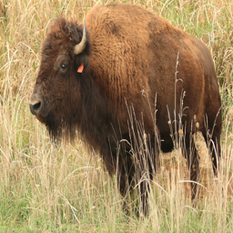
  </td>
  <td>
    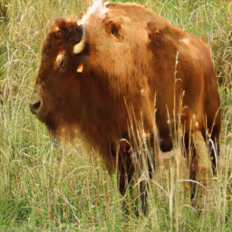
  </td>
  <td>
    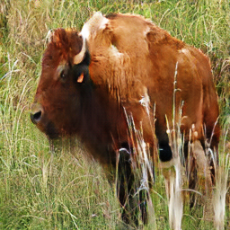
  </td>
  <td>
    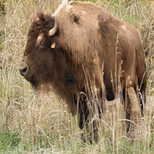
  </td>
</tr>
<tr>
  <td>
    real_C
  </td>
  <td>
    bi CtoA
  </td>
  <td>
    CtoA
  </td>
  <td>
    bi CtoAtoB
  </td>
</tr>
<tr>
  <td>
    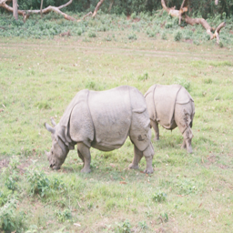
  </td>
  <td>
    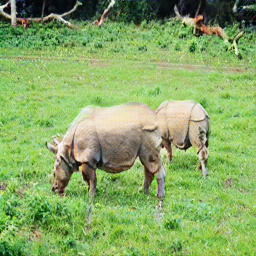
  </td>
  <td>
    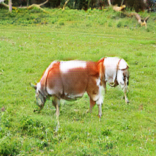
  </td>
  <td>
    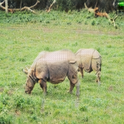
  </td>
</tr>
<tr>
  <td>
    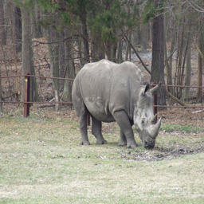
  </td>
  <td>
    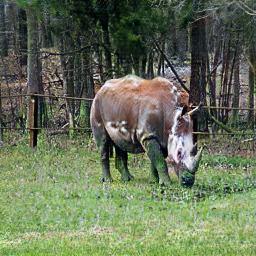
  </td>
  <td>
    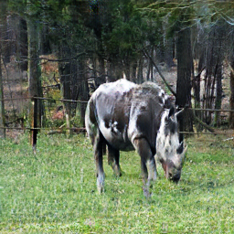
  </td>
  <td>
    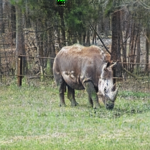
  </td>
</tr>
</table>
<table border=2 align=center  width="100%">
  做得很差的CVASE
<tr>
  <td>
    real_A
  </td>
  <td>
    bi AtoB
  </td>
  <td>
    AtoB
  </td>
  <td>
    bi AtoC
  </td>
  <td>
    AtoC
  </td>
</tr>
<tr>
  <td>
    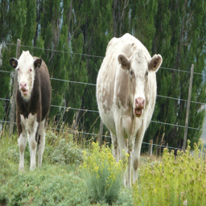
  </td>
  <td>
    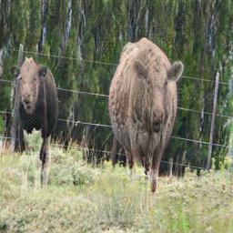
  </td>
  <td>
    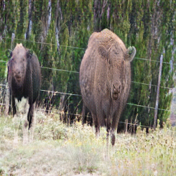
  </td>
  <td>
    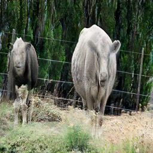
  </td>
  <td>
    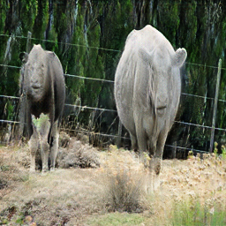
  </td>
</tr>
<tr>
  <td>
    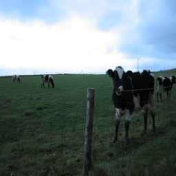
  </td>
  <td>
    
  </td>
  <td>
    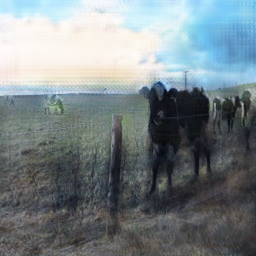
  </td>
  <td>
    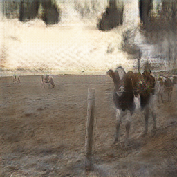
  </td>
  <td>
    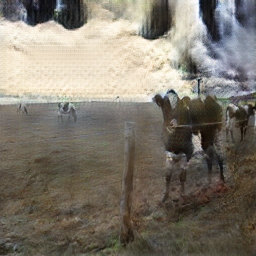
  </td>
</tr>
<tr>
  <td>
    real_B
  </td>
  <td>
    bi BtoA
  </td>
  <td>
    BtoA
  </td>
  <td>
    bi BtoAtoC
  </td>
</tr>
<tr>
  <td>
    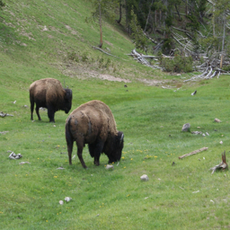
  </td>
  <td>
    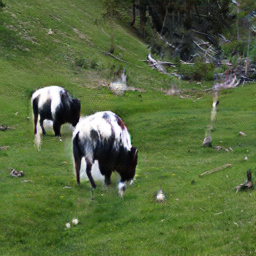
  </td>
  <td>
    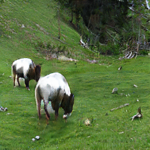
  </td>
  <td>
    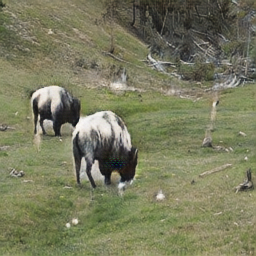
  </td>
</tr>
<tr>
  <td>
    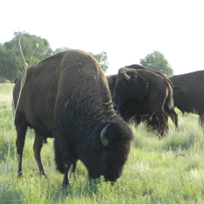
  </td>
  <td>
    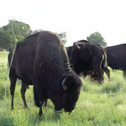
  </td>
  <td>
    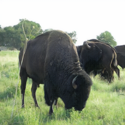
  </td>
  <td>
    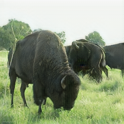
  </td>
</tr>
<tr>
  <td>
    real_C
  </td>
  <td>
    bi CtoA
  </td>
  <td>
    CtoA
  </td>
  <td>
    bi CtoAtoB
  </td>
</tr>
<tr>
  <td>
    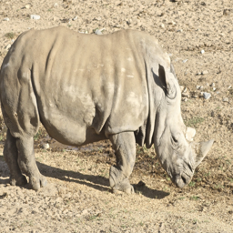
  </td>
  <td>
    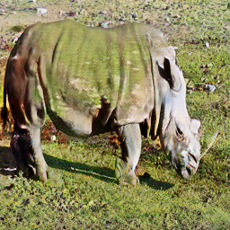
  </td>
  <td>
    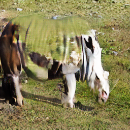
  </td>
  <td>
    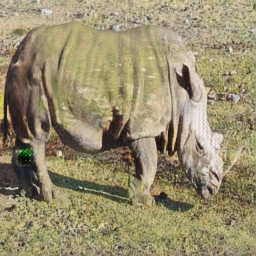
  </td>
</tr>
<tr>
  <td>
    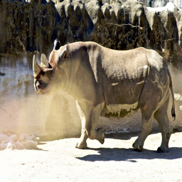
  </td>
  <td>
    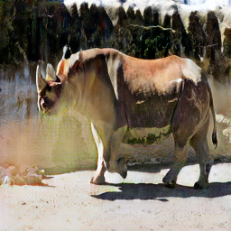
  </td>
  <td>
    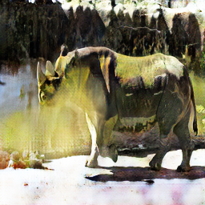
  </td>
  <td>
    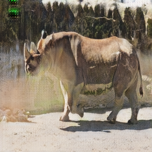
  </td>
</tr>
</table>

### My thoughts 
> you can make some comments on the your own homework, e.g. what's the strength? what's the limitation?
 
由於task都是部份區域，而非整張圖片。
故背景過於雜亂，或前景物體單調到與背景合為一體的輸入，會導致輸出效能較差。
bi-cycle的loss讓GAN不會學到太偏，補足原本 noisy data 造成的嚴重影響
最終task效果與預期之間相差不少，歸因於下列:
1. 原始Data背景過於複雜，三類牛所在的環境截然不同，讓GAN學習多餘的部分(背景)
2. CycleGANs 本身偏向 Texture 變更，上述的動機中，也想要對 Edge 做變更，不適非常貼合預想的功能

### Others

### Reference
CycleGan: https://github.com/junyanz/pytorch-CycleGAN-and-pix2pix
Animals with Attributes 2: https://cvml.ist.ac.at/AwA2/

